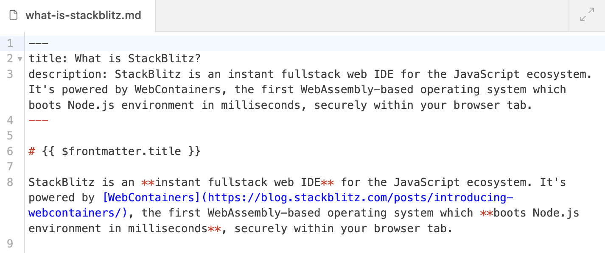
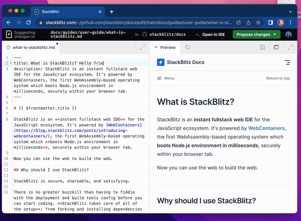

# {{ $frontmatter.title }}

Content update? A small typo fix? No worries - Web Publisher makes this experience pleasant, including those of us who are not technical!

This page covers using Web Publisher to update your blog posts, docs, or wiki pages.

## What is Web Publisher?

<!--@include: ./parts/web-publisher.md-->

## Editing a page in Web Publisher

To edit a page, you need to find its corresponding file on GitHub. You can do it in three ways: 
- ["Edit in Web Publisher"](#edit-in-web-publisher-button) button,
- ["Edit this page on GitHub"](#edit-this-page-on-github) link,
- [through a GitHub repository](#through-github).

### "Edit in Web Publisher" button

If the page features our button, that's it! Click on it and you will be redirected to our friendly publishing tool 💕

:::tip Request the button!
If the page doesn't feature our button, you can suggest to the page admins to include it - here's our [Web Publisher integration guide](./integrating-web-publisher).
:::

### "Edit this page on GitHub" link

Many pages feature a link that says "Edit this page on GitHub". If that's also the case with the page you want to edit, click the link. On the page that opened, replace `github.com` with `pr.new` - and you will be redirected to Web Publisher.

In the Preview panel on the right side, open the page you want to edit. You will see the edits you introduce as you type (or with a little delay).

### Through GitHub 

Follow these steps:
1. Go to the repository of the page. 
2. Find the file you want to edit. Find the "Edit" icon (of a pencil) and click on it. 
3. Replace `github.com` with `pr.new` and you will be redirected to Web Publisher.
4. In the Preview panel on the right side, navigate to the page you want to edit.

## On your screen

Welcome to Web Publisher, a friendly publishing tool for content updates on blogs, docs, wikis, and other pages.

Let us give you a quick tour around this tool.

### Top navigation bar

On the **left side**, you'll find the information about which file you're editing and in which repository.

On the **right side**, you'll find three buttons:
- **"Open in IDE"**, which redirects to [Codeflow IDE](./working-in-codeflow-ide) - helpful when you want to add images or work on a few files.
- **"Propose changes"**, which opens a dropdown with a button to "make a pull request" (which means sending the changes to the repository owner).
- **Your Profile**, which opens a new browser tab with your StackBlitz profile page.

### Editor

Editor is where you will introduce your changes - it is located on the left side or, if the expanded view is enabled, takes a whole center space. 

Note that it is possible to specify in the link that Web Publisher will load with the editor on full screen.

In the **top left corner**, you will see the name of the file you're editing.

In the **top right corner**, you will see an icon that either expands the Editor view or switches back to split screen.

### Live Preview

Live Preview is where you can verify the changes you've introduced. It updates as you type (or with a little delay). It is located on the right side or, if the expanded view is enabled, takes a whole center space.

Note that it is possible to specify in the link that Web Publisher will load with the Preview on full screen.

In the top left corner, you will see the name of the panel ("Preview") and an arrow icon that allows you to trigger a refresh if the changes you introduced are not updating.

In the top right corner, you will see three icons:
- **"Terminal"** which opens a terminal window at the bottom where you can see the terminal output, including possible errors (these might be helpful when reporting an issue).
- **"Open in new tab"** which opens a new browser tab with the Preview in case you want to see it full screen.
- **"Expand the view"** or **"Switch back to split screen"** icon.

## Updating the content

Use the Editor to update the content and see verify your changes look on the page in the Preview.

:::tip New to Markdown?
If the name of the edited file ends in `.md`, this is a Markdown file and it may feature "strange" characters. Don't worry, here's a [Markdown cheatsheet](https://www.markdownguide.org/cheat-sheet/) that will help you decipher and use them effectively!
:::

## Submitting your changes

You've introduced the edits and you're ready to submit them for the review. 

:::warning IMPORTANT:
Before you send the changes to the owner of the page, please double check the text for typos, stylistic errors, links that don't work, and so on. Make sure that your edits are top-notch and are actually helpful.
:::

**Ready to submit? Follow these steps:**

1. In the top right corner, click on the green button that reads "Propose changes".
2. In the dropdown window, click on "Commit proposed changes". Web Publisher will "push changes", which means that your edits are being sent to GitHub. In fact, Web Publisher first creates "a fork" (which means "a copy") of the GitHub repository, saves the changes and only them sends them to GitHub.
3. A new browser tab will open with a form to "Open a pull request" (which means "suggest changes to the owner of the page"). Fill it out, including the description of the changes you made and explanation of your reasoning and motivation behind it. Please keep the information that the pull request was made with Web Publisher (already pre-filled).

Congratulations! You've submitted the edits 🥳

## Compatibility Mode

<!--@include: ./parts/wp-compatibility-mode.md-->