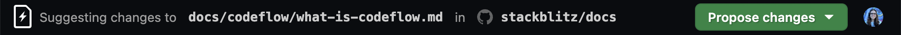
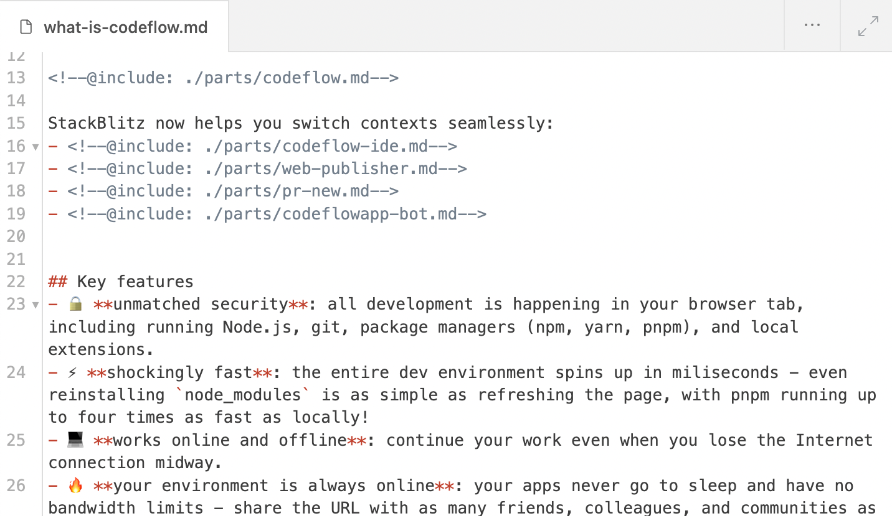
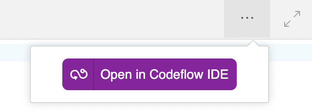

# {{ $frontmatter.title }}

Обновление контента? Небольшое исправление опечатки? Не беспокойтесь - Web Publisher делает этот опыт приятным, включая тех из нас, кто не является техническим специалистом!

На этой странице рассказывается об использовании Web Publisher для обновления записей в блоге, документов или страниц вики.

## Что такое веб-издатель?

<!--@include: ./parts/web-publisher.md-->

## Редактирование страницы в Web Publisher

Чтобы отредактировать страницу, необходимо найти соответствующий файл на GitHub. Вы можете сделать это тремя способами: 
- ["Редактировать в Web Publisher"](#edit-in-web-publisher-button) кнопка,
- ["Редактировать эту страницу на GitHub"] (#edit-this-page-on-github) ссылка,
- [через репозиторий GitHub](#through-github).

### "Редактирование в Web Publisher" кнопка

Если на странице есть наша кнопка, это то, что нужно! Нажмите на него, и вы будете перенаправлены на наш дружественный инструмент публикации 💕

:::tip Request the button!
Если на странице нет нашей кнопки, вы можете предложить администраторам страницы включить ее - вот наше руководство по интеграции [Web Publisher](./integrating-web-publisher).
:::

### "Редактировать эту страницу на GitHub" ссылка

На многих страницах есть ссылка "Редактировать эту страницу на GitHub". Если это относится и к странице, которую вы хотите отредактировать, щелкните ссылку. На открывшейся странице замените `github.com` на `pr.new` - и вы будете перенаправлены в Web Publisher.

На панели предварительного просмотра справа откройте страницу, которую нужно отредактировать. Вы увидите внесенные вами правки по мере набора текста (или с небольшой задержкой).

### Через GitHub 

Выполните следующие действия:
1. Перейдите в хранилище страницы. 
2. Найдите файл, который вы хотите отредактировать. Найдите "Редактировать" значок (карандаш) и нажмите на него. 
3. Замените `github.com` на `pr.new` и вы будете перенаправлены на Web Publisher.
4. На панели предварительного просмотра справа перейдите к странице, которую вы хотите отредактировать.

## На вашем экране

Добро пожаловать в Web Publisher, дружественный инструмент публикации для обновления контента в блогах, документах, вики и других страницах.

Давайте проведем краткий экскурс по этому инструменту.

### Верхняя панель навигации

На **левой стороне** вы найдёте информацию о том, какой файл вы редактируете и в каком хранилище.

На **правой стороне** вы найдёте две кнопки:
- **"Предложить изменения "**, который открывает выпадающий список с кнопкой "сделать запрос на вытягивание". (что означает отправку изменений владельцу репозитория).
- **Ваш профиль**, после чего откроется новая вкладка браузера со страницей вашего профиля StackBlitz.

### Редактор

Редактор - это место, где вы будете вносить свои изменения - он расположен слева или, если включен расширенный вид, занимает все центральное пространство. 

Обратите внимание, что в ссылке можно указать, что Web Publisher будет загружать редактор на полный экран.

В **левом верхнем углу** вы увидите название редактируемого файла.

В **правом верхнем углу** вы увидите два значка:
- "..." иконка, которая открывает всплывающее окно с кнопкой **"Открыть в Codeflow IDE "**, перенаправляющей на [Codeflow IDE](./working-in-codeflow-ide) - это полезно, когда вы хотите добавить изображения или поработать над несколькими файлами.
- значок в виде двуконечной стрелки, которая либо расширяет вид редактора, либо переключает обратно на разделённый экран.

### Предпросмотр в прямом эфире

Живой предварительный просмотр - это место, где вы можете проверить внесенные изменения. Он обновляется по мере ввода текста (или с небольшой задержкой). Он расположен справа или, если включен расширенный вид, занимает все центральное пространство.

Обратите внимание, что в ссылке можно указать, что Web Publisher будет загружать предварительный просмотр на полный экран.

В левом верхнем углу вы увидите название панели ("Предварительный просмотр") и значок со стрелкой, который позволяет вызвать обновление, если внесенные вами изменения не обновляются.

В правом верхнем углу вы увидите три значка:
- **"Terminal "**, который открывает окно терминала внизу, где вы можете увидеть вывод терминала, включая возможные ошибки (это может быть полезно при сообщении о проблеме).
- **"Открыть в новой вкладке "**, которая открывает новую вкладку браузера с предварительным просмотром, если вы хотите увидеть его во весь экран.
- **"Расширить обзор "** или **"Переключиться обратно на разделённый экран "**.

## Обновление содержания

Используйте редактор для обновления содержимого и проверьте, как ваши изменения выглядят на странице в режиме предварительного просмотра.

:::tip New to Markdown?
Если имя редактируемого файла заканчивается на `.md`, то это файл Markdown, и он может иметь "странные" свойства. персонажи. Не волнуйтесь, вот [Markdown cheatsheet](https://www.markdownguide.org/cheat-sheet/), который поможет вам расшифровать и эффективно использовать их!
:::

## Представление ваших изменений

Вы внесли правки и готовы отправить их на рецензию. 

:::warning IMPORTANT:
Прежде чем отправить изменения владельцу страницы, пожалуйста, дважды проверьте текст на наличие опечаток, стилистических ошибок, неработающих ссылок и так далее. Убедитесь, что ваши правки первоклассны и действительно полезны.
:::

**Готовы подать заявку? Выполните следующие действия:**

1. В правом верхнем углу нажмите на зеленую кнопку с надписью "Предложить изменения".
2. В выпадающем окне нажмите "Зафиксировать предложенные изменения". Web Publisher будет "продвигать изменения", что означает, что ваши правки отправляются на GitHub. Фактически, Web Publisher сначала создает "вилку". (что означает "копия") репозитория GitHub, сохраняет изменения и только потом отправляет их в GitHub.
3. В новой вкладке браузера откроется форма "Open a pull request" ("Открыть запрос"). (что означает "предложить изменения владельцу страницы"). Заполните его, включая описание изменений, которые вы внесли, и объяснение причин и мотивов, побудивших вас к этому. Пожалуйста, сохраните информацию о том, что запрос был сделан с помощью Web Publisher (уже предварительно заполнена).

Поздравляю! Вы отправили правки 🥳.

## Режим совместимости

<!--@include: ./parts/wp-compatibility-mode.md-->