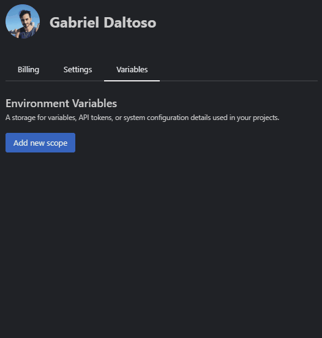

# {{ $frontmatter.title }}

One way to handle reusable configuration data, such as sensitive data, is to use environment variables. These are encrypted values that can be set for each project and each user. This way, you can customize your configuration data without exposing it to others.

### Configuring

To add a environment variable to a project, go to your [settings page](https://stackblitz.com/settings/variables) and visit the "Variables" tab. 
For each project you'll need to create a scope. You can do that by clicking on "Add new scope" button.

A form will appear asking you to add:
 - the repository to add your variable to, following the `owner/repository` pattern
 - The key 
 - The value  

 _The key-value pair must follow [`Dotenv`](https://hexdocs.pm/dotenvy/0.7.0/dotenv-file-format.html) guidelines_

