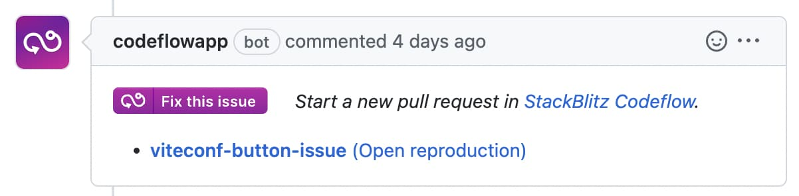

# {{ $frontmatter.title }}

This page covers integrating CodeflowApp Bot into your GitHub repositories.

## What is CodeflowApp Bot?

<!--@include: ./parts/codeflowapp-bot.md-->

### Pull requests
Once integrated, it will comment on every PR with a link to instantly run and review it:


### Issues

Whenever an issue is opened, CodeflowApp checks if a stackblitz.com bug reproduction URL is present in the comment text.

If reproduction URL is present, CodeflowApp will comment with a "Fix this issue" button that allows you to start a new pull request with the bug reproduction mounted in a sibling folder next to your repo directory for live testing:



## Installing the CodeflowApp Bot

To install the CodeflowApp bot on a repository, you will install it using GitHub UI.

1. Visit [CodeflowApp profile page](https://stackblitz.com/install-github-app)
2. Select the account or organization, as well as the repositories you want the bot to have access to. 
  -  If you choose “all in Organization”, CodeflowApp bot will be installed on all repositories in your organization.
  - Please don't worry - if you change your mind, you can change the bot access or completely disable it!

<!--@include: ./parts/installing-codeflowapp.md-->

## Disabling CodeflowApp Bot

Once installed, the bot will be enabled by default on the repository and will be triggered whenever there is a new PR or an issue.

To disable the bot:

1. Create `.stackblitz` folder in the root directory of the project.
2. Inside this folder, create a file called `codeflow.json`, specifying which actions you want disabled:

```json
// .stackblitz/codeflow.json

{
    "bot": {
        "issues": {
            "enabled": false
        },
        "pullRequests": {
            "enabled": false
        }
    }
}
```

Alternatively, you can also pause or uninstall the bot [through the GitHub UI](https://docs.github.com/en/developers/apps/managing-github-apps/deleting-a-github-app).


## Enabling package overrides for issue reproductions

Codeflow allows users to specify which packages they want to override in `package.json` and where the packages are located. A pnpm override is what is going to be installed when you run pnpm i instead of what is defined in a package.json file.

:::info pnpm override
A [pnpm override](https://pnpm.io/package_json#pnpmoverrides) "instructs pnpm to override a dependency in the dependency graph. This is useful to enforce all your packages to use a single version of a dependency, backport a fix, or replace a dependency with a fork."
:::

### pnpm override use case scenario

For example, an issue is submitted to Vite with a StackBlitz reproduction.
1. A maintainer opens the issue in Codeflow IDE. Codeflow IDE pulls the reproduction that is defined in the issue, puts it in a reproduction folder, and
reads the `codeflow.json` file. 
2. If that file defines an override, Codeflow adds them to the repro’s `package.json` file. So, for example, instead of pulling Vite from npm, it will link the local vite project into that reproduction instead.
3. The maintainer can then run `pnpm i` in the repro and pnpm will install the dependencies defined in the override.

:::info TL;DR
Using pnpm override, you can fix a bug and immediately try it out in the reproduction the user provided.
:::

### Enabling pnpm overrides

To set up pnpm overrides, follow these steps:
1. In the project's root directory, create `.stackblitz` directory.
2. Inside it, create a file called `codeflow.json`.
3. In the file, specify the overrides by providing a key-vaue pair of the dependency to override and the folder where it is located. Please note that the location is relative to the root of the project.

```json
// .stackblitz/codeflow.json

{
    "pnpm": {
        "overrides": {
            "vite": "./packages/vite"
        }
    }
}
```
