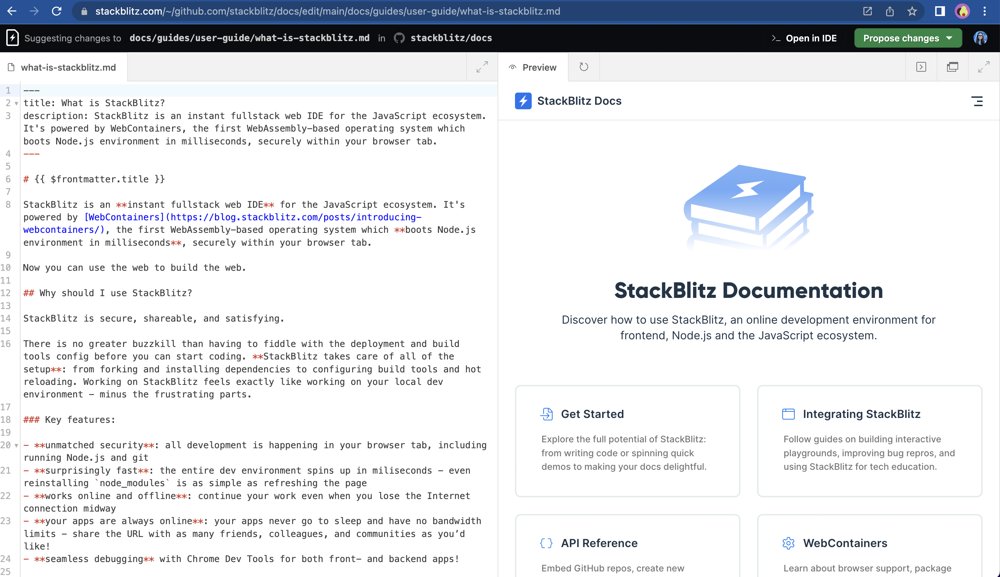
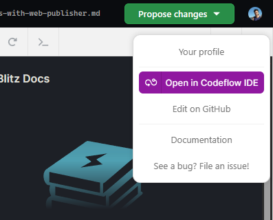
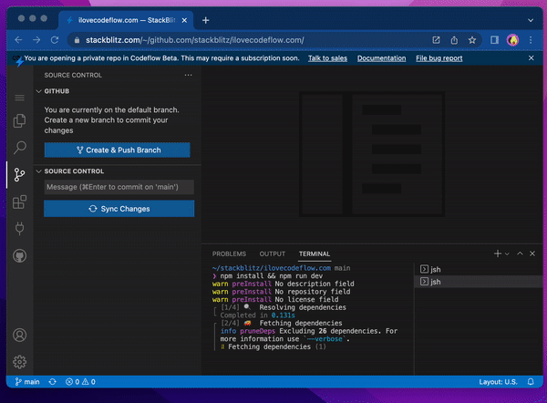

# {{ $frontmatter.title }}

This page covers integrating Web Publisher into your docs to lower the barrier for contributing to documentations.

## What is Web Publisher?

Web Publisher is a page editing tool that makes docs contribution stress-free, including those of us who are not technical.

Web Publisher features a **preview that live updates** as you introduce your edits. **Once you are ready, Web Publisher commits changes, creates a fork and a pull request for you.** You don't need to have the local environment set up, clone the repository, install dependencies, or run the server to see the changes. All this is happening inside your browser.

All you need to edit the docs in Web Publisher is a StackBlitz account.

## Modifying multiple files

Web Publisher allows you to edit a single page. 

However, some edits require modifying a few files. In this case, you can switch to the Codeflow IDE environment, which will run the whole repository.

To do so, click on the your profile picture icon in the top right corner of the Editor panel, which will show a popup with "Open in Codeflow IDE" button:

You will be redirected to the Web Studio editor and you can continue your work.

## Adding Web Publisher to your docs

This section will guide you step by step through integrating Web Publisher to your docs.

### 1. Repository compatibility check

Before you begin, verify your toolchain works in WebContainers. To do this, add `pr.new` to the beginning of your docs repository GitHub URL. 

:::info Example
This is the GitHub address of the StackBlitz docs repository:

`https://github.com/stackblitz/docs/`

To check if this repository runs in WebContainers, we'll add `pr.new` to the beginning of the URL:

`https://pr.new/github.com/stackblitz/docs/`
:::

If you see that **the preview loads correctly** (see below), this means that your dev server runs properly in WebContainers and your repository is compatible.

### 2. Specify the Web Publisher editing link

Let's compose a URL that will specify which file the Web Publisher should feature in the editor and which path to render in the preview. You can use the link generator below or build the link yourself.

:::tip Web Publisher link generator
Alternatively, you can use the **Web Publisher link generator** to compose your link:

<iframe src="https://stackblitz.com/edit/vue-c2wltp?embed=1&file=src/App.vue&hideExplorer=1&hideNavigation=1&view=preview&ctl=1" style="width:100%;height:450px;border:1px solid var(--vp-custom-block-tip-border);border-radius:10px"></iframe>
:::

Web Publisher links follow this pattern:

`https://pr.new/github.com/{repository-owner's-username}/{repository}/edit/{branch}/{file-path-in-the-repository}`

For example, here is a Web Publisher link to our docs page:

`https://pr.new/github.com/stackblitz/docs/edit/main/docs/guides/user-guide/what-is-stackblitz.md`

### Customize the link
Now that you have the base link, you can further **customize user experience with query parameters**. 

:::info
To specify the first parameter, add `?` at the end of the base link. Connect the subsequent ones with `&`. 
:::

### `initialPath`

    <b>Default behavior:</b> the Preview window renders the homepage as not always the file path or file name is the same as the rendered route. 
    <b>Argument:</b> A route to be rendered. 
    <b>Example:</b> <code>initialPath=guides/user-guide/what-is-stackblitz</code> 

### `view`

    <b>Default behavior:</b> Web Publisher features the Editor and the Preview.  
    <b>Argument:</b> <code>editor</code> | <code>preview</code> | <code>default</code> 
    <b>Example:</b> <code>view=editor</code> 

### 4. Optional: Installing CodeflowApp bot

<!--@include: ./parts/codeflowapp-bot.md-->

<!--@include: ./parts/installing-codeflowapp.md-->

Follow [this integration guide](./integrating-codeflowapp-bot.md) to integrate CodeflowApp bot into your project.

<!-- ### 5. Configure "edit this page"

To enable edits on the sites created via generators, you need to change the default settings. Consult the table below to find which files to change. -->

## "Edit in Web Publisher" button

To help your users easily find their way to Web Publisher on your site or repository, you can add a CTA (call-to-action) button on your website or in the README file. 

| Button preview | Direct URL |
| --- | --- |
|  | <a href="/img/edit_in_web_publisher.svg" target="_blank">edit_in_web_publisher.svg</a> |
|  | <a href="/img/edit_in_web_publisher_small.svg" target="_blank">edit_in_web_publisher_small.svg</a> |

::: tip
You can either host the images on your servers or directly use our image URLs.
:::

## Compatibility Mode

<!--@include: ./parts/wp-compatibility-mode.md-->
