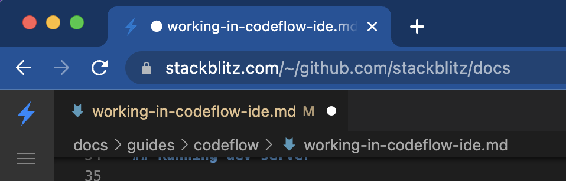

# {{ $frontmatter.title }}

Are you ready to **make Codeflow your workflow?** 🔥 

This page covers what to expect when using Codeflow IDE.

## What is Codeflow IDE?

<!-- @include: ./parts/codeflow-ide.md -->

It is designed for enabling you to quickly spin up the entire environment without the hassle of cloning and installing dependencies.

:::tip Fun fact

At StackBlitz, we have been using Codeflow IDE in our daily internal development, including PR reviews. This docs site was also built on Codeflow IDE and Web Publisher!

:::

## Opening GitHub repositories in Codeflow IDE

To open a GitHub repository in Codeflow IDE, swap "github.com" with "pr.new" in the repository URL. 

:::details Intrigued by "pr.new"?  👀
If you're curious about this short URL, learn about the [full potential of "pr.new"](./using-pr-new).
:::

If you are not logged into StackBlitz, while this product is in beta, you will be prompted to login or create a new account.

## Troubleshooting the Preview

### Preview doesn't work

If the Preview doesn't work, oftentimes browser configuration or browser incompatibility is the culprit. Please see [this page for troubleshooting](/platform/webcontainers/browser-support). 

### Preview stopped working / is not responding

Please note that, depending on the framework, **some changes may cause the dev server to stop running**, which in turn causes the Preview to either not respond to new updates or show an error screen ("Unable to connect to `local.webcontainer.io`"). 

Check in the terminal if the dev server is still running. If you want to restart it, click in the terminal window and:
1. press `ctrl`+`c` to "kill" the server,
2. press the "up arrow" button to bring up the start command,
3. press enter to run that command,
4. in the popup notification in the bottom right corner, choose to open the Preview.

### Reopening the Preview panel 

If you close the Preview by accident, you can reopen it by selecting the icon of a plug entitled "Ports in use" from the left-side navigation bar. Note that you can open the Preview in a separate tab or as a split screen.

## Saving changes

Whenever a file is changed, you will see a white dot next to its tab in the editor. 

Moreover, you will also see that dot on the tab in your browser to remind you that you have unsaved changes.

:::warning

<!--@include: ./parts/persistance.md-->

:::

## Making a PR with Codeflow IDE

Let's add a file to [ilovecodeflow.com](https://github.com/stackblitz/ilovecodeflow.com).

Follow these steps:

1. Open the link in a new tab. In the GitHub URL of the repository, replace `github.com` with `pr.new`.
2. Open the Preview by clicking on the popup notification in the bottom right corner.
3. Introduce some changes - for instance, in the `/src/pages/LoveNote.astro` file change the emojis.
4. Verify the changes in the Preview on the right.
5. Depending on your role:
    - commit the changes by selecting "Source Control" icon in the left vertical navigation bar, clicking "Create & Push Branch", and naming the branch; or
    - fork the repository.
6. Click on "Commit & Push" to send the changes to GitHub.
6. Finally, you can submit your pull request by clicking on the "Open New PR" button 🥳

## Reviewing a PR with Codeflow IDE 

Let's look at [this suspicious PR](https://pr.new/stackblitz/docs/pull/40).

Follow these steps:
1. Open the link in a new tab. In the GitHub URL of the repository, replace "github.com" with "pr.new".
2. Codeflow IDE will spin up in the "PR Review mode". Open the Preview by clicking on the popup notification in the bottom right corner.
3. Compare suggested changes with the original file. You can also see the edits rendered in the Preview panel if you navigate to the edited page - in this case, the "What is StackBlitz" page.
4. You can add comments by clicking on the "+" icons, read other comments, or start a review.
5. If you no longer want to see the changes in the "PR Review mode", close the relevant files.

## Using the CodeflowApp bot

<!--@include: ./parts/codeflowapp-bot.md-->

To integrate the bot, please follow the instructions on [Integrating CodeflowApp bot](./integrating-codeflowapp-bot.md).

