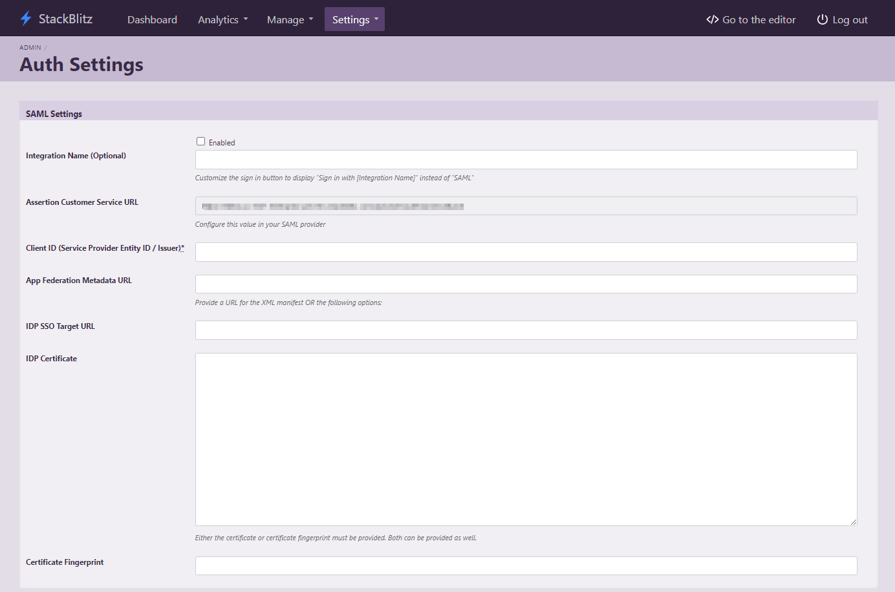

# {{ $frontmatter.title }}

StackBlitz is excited to offer SAML-based Single Sign-on (SSO) to organizations using Active Directory Federation Service (ADFS). To enable this feature, you need to be logged in as an admin within StackBlitz. If you are also an admin for ADFS and have the ability to create Relying Party Trusts, we can get started! If not, you will need to coordinate with the manager of your organization's ADFS.

:::info Please note the following:

- Depending on your version of Windows and ADFS, these instructions may differ slightly from your experience.
- Each user account must have a unique email address. Use a service account email address (like IT@yourcompany.com) to ensure that the admin account doesn't cause email collisions for SSO users. After SAML is enabled, all non-admin members in StackBlitz must log in with SAML. The superadmin user can still log in with a password as needed.
- Only StackBlitz admins have the superpowers to enable SAML for the organization.
- StackBlitz offers just-in-time provisioning. This means that if a user logs into StackBlitz for the first time using SSO, an account will automatically be created.
:::

## StackBlitz Admin Panel Auth Settings Page

:::warning IMPORTANT: 
Admin accounts should not be made with an individual work email that will be used to create a separate user account later. Should this happen, we recommend the following steps:
  - Log in as admin
  - Navigate to `https://editor.stackblitz.[COMPANY.COM]/users/edit` to change your email address to a different one. It will show the same screen as the changing email/password when first logging in as an admin, but you only need to change your email.
:::

Begin by logging into your StackBlitz admin account and click on "Setup Authentication". This will take you to the "Auth Settings" page:

This page can also be accessed directly at `https://editor.<Your StackBlitz Domain>/admin/auth_settings`.

Please take note of the "Assertion Customer Service URL" as it will be used in the next part of the installation.

## Add a New Relying Party Trust

Begin by logging into your ADFS host to open the ADFS Management tool. In the left-hand navigation bar, choose "Relying Party Trusts", then "Add Relying Party Trust..." from the right-hand navigation.

Leave "claims aware" selected and press "Start" to begin configuration. On the following screen, select "Enter data on the relying party manually" and press "Next" to continue.

Enter a display name for the relying party trust. This is an arbitrary value that is only used to identify the trust entry in the ADFS Management console. We recommend setting it to the URL of your StackBlitz installation. Once you've chosen a display name, click "Next." On the next screen, leave the encryption settings the same and click "Next" again.

Choose "Enable support for the SAML 2.0 WebSSO protocol" and enter the "Assertion Customer Service URL" value you noted earlier from the StackBlitz Auth Settings page into the "Relying party SAML 2.0 SSO service URL" field. Click "Next."

On the "Configure Identifiers" screen, add a "Relying party trust identifier." You may enter an arbitrary value, but we reccommend using your StackBlitz URL. Keep a note of the value you enter here because you will need to repeat it exactly in a future step. Click "Add" to save the identifier and press "Next."

On the "Choose Access Control Policy" screen, choose "Permit Everyone" and press "Next."

On the "Ready to Add Trust" screen, review your selections and press "Next" to complete the wizard. On the following screen, enable "Configure claims issuance policy for this application" and press "Close." The "Edit Claim Issuance Policy..." window should appear.

On this screen you will add two (2) rules: StackBlitz Attributes and Name ID. Click "Add Rule" to begin the rule wizard. Create the following rules:

Claim rule template: Send LDAP Attribures as Claims

Claim rule template: Transform an Incoming Claim

Once you've added both rules, click "OK" to close the Rules editor.

Now you need to get the thumbprint of your ADFS Certificate: 

1. From the left-hand navigation select "Service" > "Certificates".
2. Right-click the certificate listed under "Token-signing" and click "View Certificates..."
3. Select the "Details" tab in the certificate window.
4. Scroll down to "Thumbprint" and select it.
5. Make a note of this value to use in the next step.

## StackBlitz SSO Configuration

Now, return to the Auth Settings page in the StackBlitz Admin Dashboard, enter the following values, and click "Save Auth Settings" below once complete:

Enabled: ✅

Issuer (Service Provider Entity ID): "Relying party trust identifier" value from earlier

IDP SSO Target URL: Your ADFS endpoint (ex: https://your.adfs.domain/adfs/ls)

Certificate Fingerprint: Thumbprint value from the previous step

## Troubleshooting

Unable to log in after following these steps? Verify the following information:

- Make sure you've put a check the "enabled" box on the auth setting page.
- Verify that your claim rules match the screenshots above exactly.
- Make sure the super admin account user's email doesn't collide with an ADFS user's email.

If you're unable to login after verifying these things, please reach out to [enterprise@stackblitz.com](mailto:enterprise@stackblitz.com) for support.
