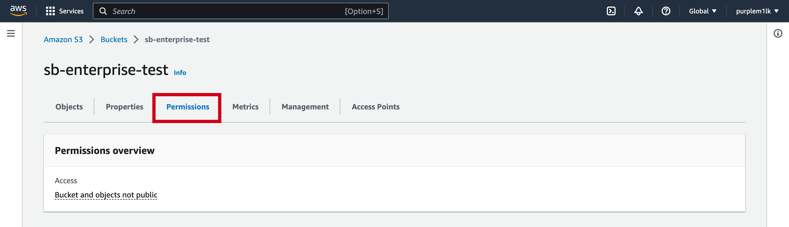
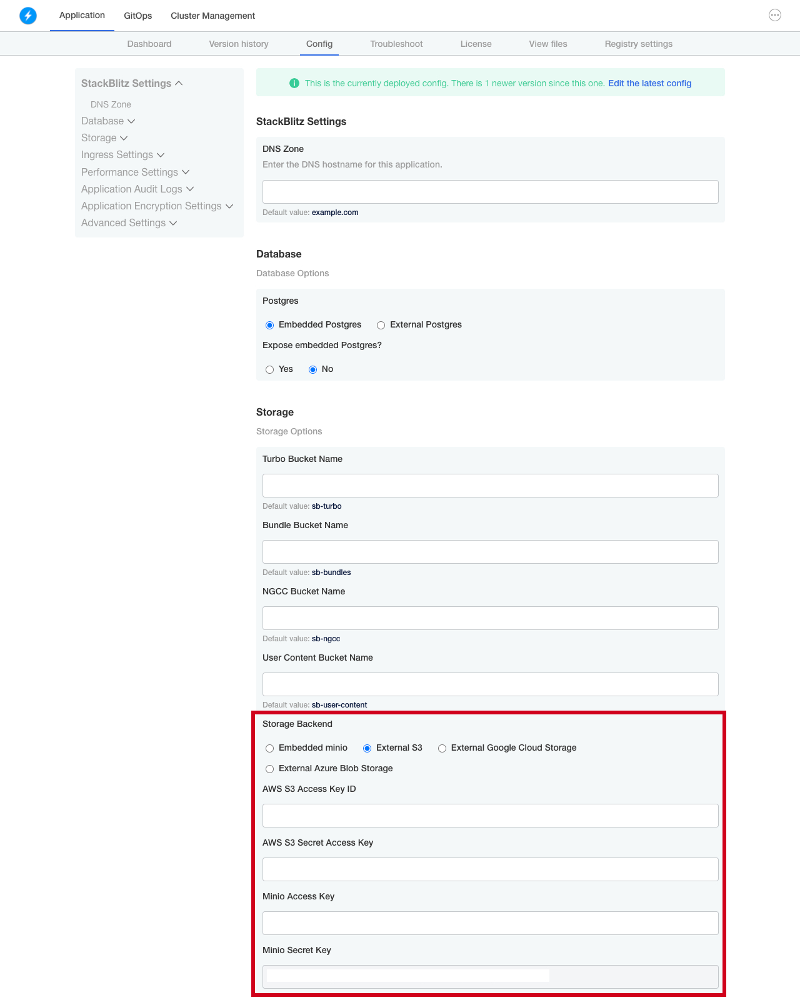

# {{ $frontmatter.title }}

:::info
This document covers in-depth custom installation and cluster operations. For a more gentle introduction to the installation process, please check out the [Quickstart](/enterprise/installation/quickstart).
:::

StackBlitz Enterprise is a Kubernetes application. You can install the software on an existing cluster or use our installer that has an embedded, production-ready Kubernetes distribution packaged with it.

## Embedded Kubernetes Installation

If you don’t have a cluster, then our install scripts can provide one. The minimum requirements for this is 16 vCPUs, 32 GB memory, and 200 GB storage running Ubuntu LTS.

```sh
curl -sSL https://k8s.kurl.sh/stackblitz | sudo bash
```

You should be able to follow the instructions on the screen to port 8800 on your server to configure your instance, add additional nodes, check for updates, among others.

<!-- If at any time you’d like to migrate this deployment to an existing Kubernetes Cluster, see the [Guide to Migrating an Existing Cluster](migrating). -->

## Existing Cluster Installation

If you have an existing cluster, you can run the following command from a workstation that has kubectl access to the cluster.

```sh
 curl https://kots.io/install | bash
 kubectl kots install stackblitz
```

This will install the kots (Kubernetes off-the-shelf software) plugin on the workstation, then install the StackBlitz Enterprise Admin Console on the cluster, and set up a port forward on the ClusterIP to enable you to access the admin from `http://localhost:8800`. From here, you’ll be walked through the preflight checks, configuration, and initial deployment of the application.

Please please see our advanced existing cluster installation instructions if you need to use your existing deployment pipeline (for instance, internal image registry, version control system), make custom configuration tweaks and/or deploy to multiple or remote environments.

# Troubleshooting

StackBlitz Enterprise has a built-in troubleshooting tool. On the admin console, click on the Troubleshoot tab, and you can download a support bundle. By default, this will run through a series of prebuilt analyzers to help identify potential issues. If you’re unable to remediate the issue, you can deliver the support bundle to our support team via a file-sharing link provided by our team or the file-sharing service of your choice and we can help you identify any problems with the StackBlitz Enterprise installation.

## Automating Day-2 Operations

### Leveraging an Internal Registry
Once the StackBlitz Admin Console is installed, you can configure it so that StackBlitz images will be retagged and pushed to your internal registry for further scanning and more. YAML will be rewritten so that images will be pulled from the specified internal registry at runtime.

### Storage
Optionally, you can provide a Postgres server. If you choose to bring your own Postgres server, it should be at least Postgres 10.4. If you don’t bring your own, the installer will provision Postgres as a Stateful set in your cluster.

## Additional tools and processes

### Changing the Admin Console Deployment

To start, you’ll need to bootstrap the process by deploying our Admin Console. The admin console is where you can provide your license. The Admin Console remains running after the installation and will be the place where you can check for updates, configure the application, read release notes, generate support bundles, and more. You can reopen the admin panel locally at any time by running `kubectl kots admin-console -n $NAMESPACE`.

### Initial Configuration

Once the admin console is running, visit `http://localhost:8800` and upload your license. StackBlitz Enterprise is delivered as ready-to-run YAML, but you might need to make some changes for your specific environment. In the Admin Console, click “Config”. This will show a form where you can provide your settings. These will be written as Kubernetes secrets in the deployment manifests.

### Config options

#### DNS Zone

Sets the DNS hostname used to expose the application and its services.

#### Database

Allows you to pick which database to use. By default, an embedded Postgres will be used. You can also choose to provide an inline Postgres or Postgres via a secret.

#### Storage

An embedded Minio is used as the storage bucket by default. You have the option to provide your own S3-compatible bucket to be used. You can also configure the bucket names to be used for Turbo, bundle hydration caching, and image storage. 

Here are steps to create and integrate your S3 bucket into your StackBlitz app:
1. Log into your AWS account and open the Amazon S3 console.
2. Click on Buckets in the left navigation pane to see the "Create bucket" button on the right-hand side of your screen.

:::info First time creating an S3 bucket? 
Check out the [AWS Docs](https://docs.aws.amazon.com/AmazonS3/latest/userguide/creating-bucket.html) for a detailed rundown of how to set up your first bucket.
:::
3. Once you've set up your s3 bucket, click into the bucket and navigate to the Permissions tab at the top. Here, you'll be setting your permissions such as Object Ownership, ACL (Access control list), CORS (Cross-origin resource sharing), and more. You may need to consult with your Security team on these permissions.



4. Once your permissions are set up, you'll need to grab the AWS S3 Access Key ID and AWS 0S3 Secret Access Key to put into the StackBlitz Admin Console at `http://localhost:8800`. In your admin console, please navigate to the Config tab to see the fields below:



5. Make sure to click 'Save Config' at the very bottom!

#### TLS settings

Here you can provide the certificate to be used for domain on which you are hosting your app.

#### Kubernetes settings 

Here you can define the namespace in which you installed the application. For embedded installs, the default should be fine. For 'existing cluster' installs, you should provide the namespace.
