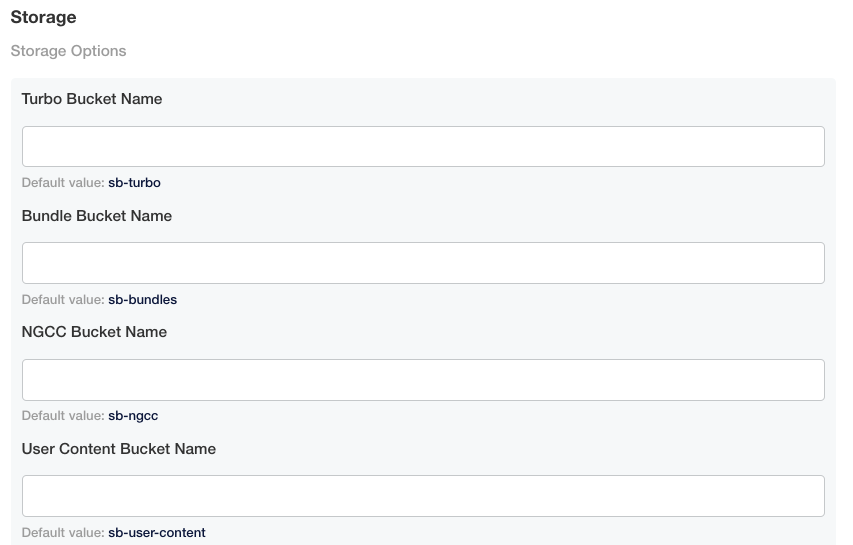
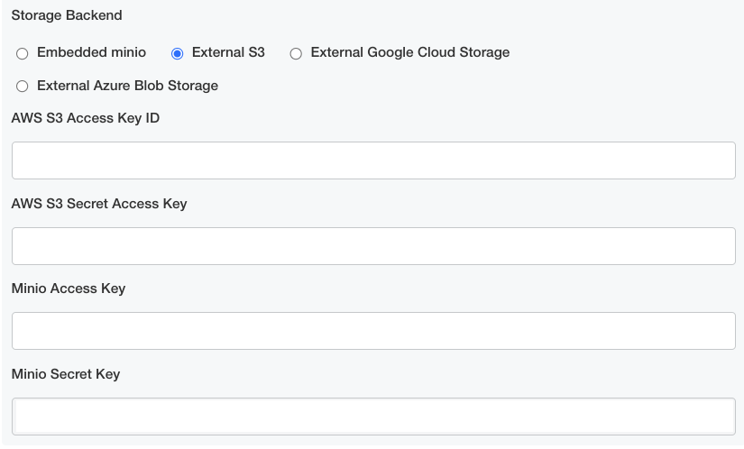
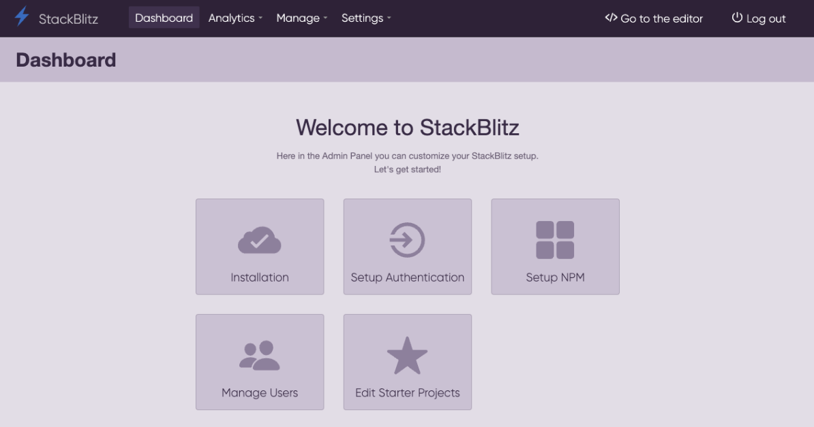

# {{ $frontmatter.title }}

:::info
This document covers in-depth custom installation and cluster operations. For a more gentle introduction to the installation process, please check out the [Quickstart](/enterprise/installation/quickstart).
:::

StackBlitz Enterprise is a Kubernetes application. You can install the software on an existing cluster or use our installer that has an embedded, production-ready Kubernetes distribution packaged with it.

## Embedded Kubernetes Installation

If you don’t have a cluster, then our install scripts can provide one. The minimum requirements for this is 16 vCPUs, 32 GB memory, and 200 GB storage running Ubuntu LTS.

```sh
curl -sSL https://k8s.kurl.sh/stackblitz | sudo bash
```

You should be able to follow the instructions on the screen to port 8800 on your server to configure your instance, add additional nodes, check for updates, among others.

<!-- If at any time you’d like to migrate this deployment to an existing Kubernetes Cluster, see the [Guide to Migrating an Existing Cluster](migrating). -->

## Existing Cluster Installation

If you have an existing cluster, you can run the following command from a workstation that has kubectl access to the cluster.

```sh
 curl https://kots.io/install | bash
 kubectl kots install stackblitz
```

This will install the kots (Kubernetes off-the-shelf software) plugin on the workstation, then install the StackBlitz admin console on the cluster, and set up a port forward on the ClusterIP to enable you to access the admin from `http://localhost:8800`. From here, you’ll be walked through the preflight checks, configuration, and initial deployment of the application.

Please see our advanced existing cluster installation instructions if you need to use your existing deployment pipeline (for instance, internal image registry, version control system), make custom configuration tweaks and/or deploy to multiple or remote environments.

# Troubleshooting

StackBlitz Enterprise has a built-in troubleshooting tool. On the admin console, click on the Troubleshoot tab, and you can download a support bundle. By default, this will run through a series of prebuilt analyzers to help identify potential issues. If you’re unable to remediate the issue, you can deliver the support bundle to our support team via a file-sharing link provided by our team or the file-sharing service of your choice and we can help you identify any problems with the StackBlitz Enterprise installation.

## Automating Day-2 Operations

### Leveraging an Internal Registry
Once the StackBlitz admin console is installed, you can configure it so that StackBlitz images will be retagged and pushed to your internal registry for further scanning and more. YAML will be rewritten so that images will be pulled from the specified internal registry at runtime.

### Storage
Optionally, you can provide a Postgres server. If you choose to bring your own Postgres server, it should be at least Postgres 10.4. If you don’t bring your own, the installer will provision Postgres as a stateful set in your cluster.

## Additional Tools and Processes

### Changing the Admin Console Deployment

To start, you’ll need to bootstrap the process by deploying our admin console. The admin console is where you can provide your license. The admin console remains running after the installation and will be the place where you can check for updates, configure the application, read release notes, generate support bundles, and more. You can reopen the admin panel locally at any time by running `kubectl kots admin-console -n $NAMESPACE`.

### Initial Configuration

Once the admin console is running, visit `http://localhost:8800` and upload your license. StackBlitz Enterprise is delivered as ready-to-run YAML, but you might need to make some changes for your specific environment. In the admin console, click “Config”. This will show a form where you can provide your settings. These will be written as Kubernetes secrets in the deployment manifests.

### Config Options

#### DNS Zone

Sets the DNS hostname used to expose the application and its services.

#### Database

Allows you to pick which database to use. By default, an embedded Postgres will be used. You can also choose to provide an inline Postgres or Postgres via a secret.

#### Storage

We support the following storage options:
- External AWS S3
- External Microsoft Azure Blob Storage
- External Google Cloud Storage
- Embedded MinIO (The option to provide your own S3-compatible bucket to be used.) 

Go into your preferred cloud provider and create four **uniquely-named** buckets/containers to correspond with the following:
  - Turbo Bucket Name
  - Bundle Bucket Name
  - NGCC Bucket Name
  - User Content Bucket Name

*Note: The bucket names above are related to their functions and all four are required. We strongly recommend that you include the function name in your newly created buckets/containers.



:::info First time creating a bucket/container? Check out these handy links for instructions on how to create your first bucket, based on your cloud provider:

- [AWS S3 Docs](https://docs.aws.amazon.com/AmazonS3/latest/userguide/creating-bucket.html)
- [Google Cloud Storage Docs](https://cloud.google.com/storage/docs/creating-buckets)
- [Microsoft Azure Blob Storage Docs](https://learn.microsoft.com/en-us/azure/storage/blobs/storage-quickstart-blobs-portal)
:::

Based on your cloud provider, you will be required to provide IDs and/or keys. The required input fields will appear once you choose your cloud provider under Storage Backend. If you are not using embedded MinIO, you can disregard the `Minio Access Key` and `Minio Secret Key` input fields.



If your DevOps provisioning process is challenging, the embedded MinIO storage option is offered with the caveat that this is a temporary setup while your actual resources are being provisioned. We do not recommend this option for long-term or production use.

#### TLS settings

Here you can provide the certificate to be used for domain on which you are hosting your app.

#### Kubernetes settings 

Here you can define the namespace in which you installed the application. For embedded installs, the default should be fine. For 'existing cluster' installs, you should provide the namespace.

# StackBlitz Admin Dashboard
Here's how to navigate through the StackBlitz admin dashbord:



You'll already be familiar with the Installation, Setup Authentication, and Setup NPM cards, so let's cover Manage Users and Edit Starter Projects.

**Manage Users:** This allows you to manage all your users, including the ability to enable the admin role, delete users, and see what projects they've created.

**Edit Starter Projects:** Each organization can create a unique collection of Starter Projects that allows their users to choose template projects so they're not having to start from scratch. As an admin, you have the ability to edit this collection with your preferred starter projects.

### Other Links:

**Analytics:** This feature allows you to see metrics of your users, such as # of active users within the past 90 days, # of new users created, etc. 

**Manage:** This link is another way for an admin to manager users, like the Manage Users card.
