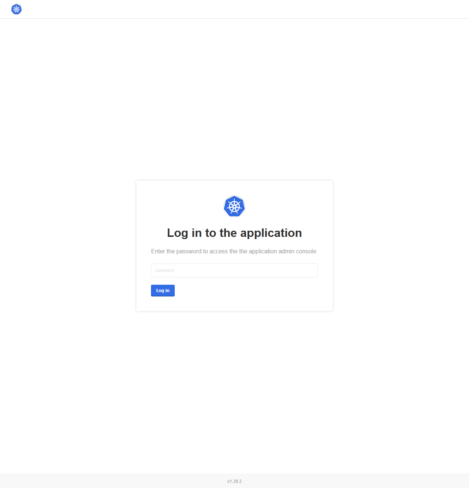

# {{ $frontmatter.title }}

:::tip
For an in-depth custom installation setup and cluster operations, please follow **[Administrator Guide](/enterprise/installation/administrator-guide)**.
:::

StackBlitz Enterprise is a Kubernetes application. You can follow these instructions to install the software on an existing Kubernetes cluster.

Alternatively, if you don't have Kubernetes set up for your organization, you can use our installer that has an embedded production-ready Kubernetes distribution packaged with it. You can view the [Quickstart on Bare Metal](/enterprise/installation/quickstart) for a quick way to get up and running without Kubernetes. Installing on an existing cluster is the recommended way of installing StackBlitz Enterprise.

For installing StackBlitz in environments with restricted network access, see [Air-Gapped Installs](/enterprise/installation/air-gapped-installs).

## Getting started on an Existing Cluster

Minimum Cluster Requirements:

- 8 vCPU,
- 32 GB Memory,
- 200 GB Storage,
- `kubectl` access to the cluster,
- Internet access from the cluster (see [Configuring Firewall Rules](/enterprise/configuring-firewall-rules) for the list of hostnames/ips that require internet access for installation, updates and licensing),
- a machine with `kubectl` access to the cluster.

:::info
If your cluster does not allow access to the external Internet, you will need to perform an [Air-Gapped Install](/enterprise/installation/air-gapped-installs).
Contact [enterprise@stackblitz.com](mailto:enterprise@stackblitz.com) if you need the air-gapped installations enabled on your license.
:::

Recommended Cluster Requirements:

- 16 vCPU
- 40 GB Memory

Make sure ports the following TCP ports are allowed to the Cluster:

- 22
- 80
- 443
- 8800
- 30902
- 8080
- 6443

StackBlitz uses [Kots](https://kots.io) to manage the installation, licensing, and delivery of updates. On a machine that has `kubectl` access to the cluster, install the `kots` CLI with the following command:

```sh
curl https://kots.io/install | bash
```

Then, install the Admin Console for StackBlitz by running:

```sh
kubectl kots install stackblitz
```

You will be prompted for a namespace in your cluster in which StackBlitz will be installed. By default, the namespace is `stackblitz`. Then Yyu will be prompted to set a password for the Admin Console:

```sh
Enter the namespace to deploy to: stackblitz
 • Deploying Admin Console
    • Creating namespace ✓
    • Waiting for datastore to be ready ✓
Enter a new password to be used for the Admin Console:
```

After choosing and submitting, you will see the following screen:

```sh
  • Waiting for Admin Console to be ready ✓

  • Press Ctrl+C to exit
  • Go to http://localhost:8800 to access the Admin Console
```

Navigate to `http://localhost:8800` to access the Admin Console. You will be prompted to log in using the password you chose before.



:::tip
To access the Admin Console again, run `kubectl kots admin-console --namespace yournamespace` (replacing `yournamespace` with your namespace).
:::

## License registration

After logging in to the Admin Console, you'll be prompted for a License.

Drag and drop your license file onto the webpage to upload it. Once this step completes, you will be presented with EE site configuration screen. It should look like this:


See the [Config Options in the Administrator Guide](/enterprise/installation/administrator-guide#config-options) for more details on each configuration option. After filling out the configuration fields, click "Continue". Your configuration will be saved. The Admin Console will deploy your configuration and begin to pull and run the images for StackBlitz. After your instance is up and running, you will need to [Configure DNS Settings](/enterprise/configuring-dns) to point your DNS zones at the IP/CNAME of your ingress.
