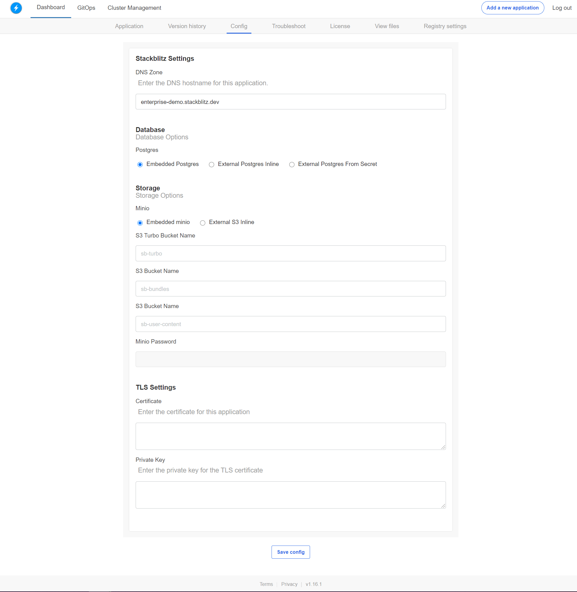

# {{ $frontmatter.title }}

:::tip
For an in-depth custom installation setup and cluster operations, please follow the **[Administrator Guide](/enterprise/installation/administrator-guide)**.
:::

StackBlitz Enterprise is a Kubernetes application. You can install the software on an existing cluster or use our installer that has an embedded, production-ready Kubernetes distribution packaged with it.

## Getting started on GCP (embedded)

If you don’t have a cluster, then our install scripts can provide one. The minimum requirements for this on GCP is n1-standard-8 (8 vCPUs, 30 GB memory).

Getting started on GCP (no GKE, no existing cluster):

- Launch an n1-standard-4 instance or larger on GCP with Ubuntu as the OS with 200gb disk space.
- Make sure ports the following TCP ports are allowed through the firewall:
  - 22
  - 80
  - 443
  - 8800
  - 30902
  - 8080
  - 6443
- Run the kots intaller command: `curl -sSL https://k8s.kurl.sh/stackblitz | sudo bash`.

:::tip Using load balancers?
Ports 80 and 443 should be forwarded from the load balancer. The remaining ports are for inbound rules on the security group.
:::

:::warning
Copy the generated password from the terminal output after installation. It's required for accessing the Admin Console and won't be shown again.
:::

In the terminal output, find these two lines:

```sh
Login with password (will not be shown again): xyzabc123
Kotsadm: http://34.184.141.48:8800
```

Follow the instructions on the screen to port 8800 on your server to configure your instance, add additional nodes, check for updates, among others.

## License registration

After visiting the `Kotsadm` URL on port 8800, you'll be presented with the Admin Console.

Drag and drop your license file onto the webpage to upload it. License verification will then take place, and the StackBlitz EE images will begin installing onto your cluster.

Once this step completes, you will be presented with EE site configuration screen. It should look like this:



After filling out the configuration fields, click "Continue". Your StackBlitz EE instance is now booted and ready for DNS configuration.
