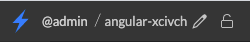
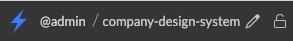
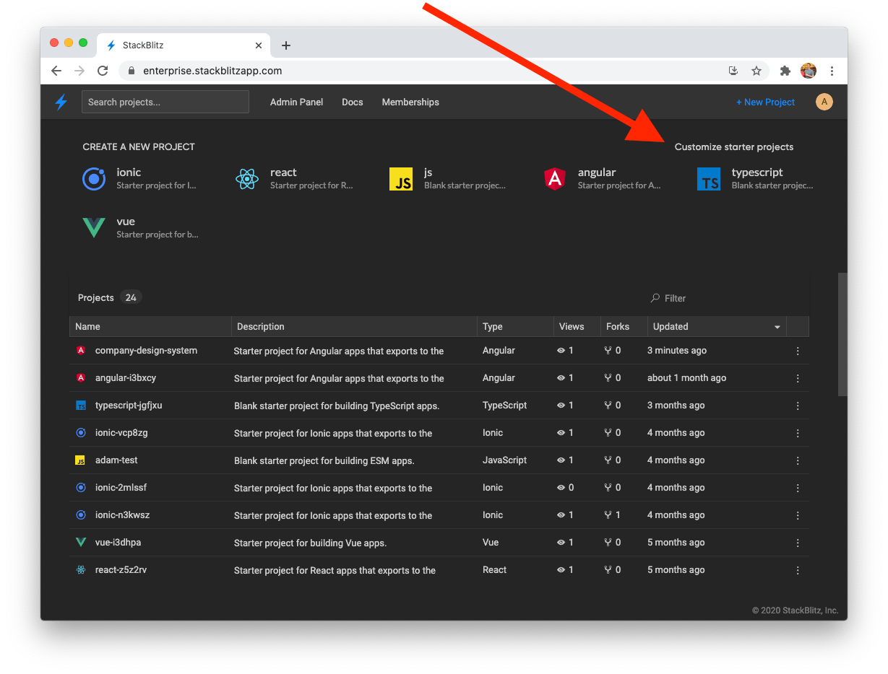
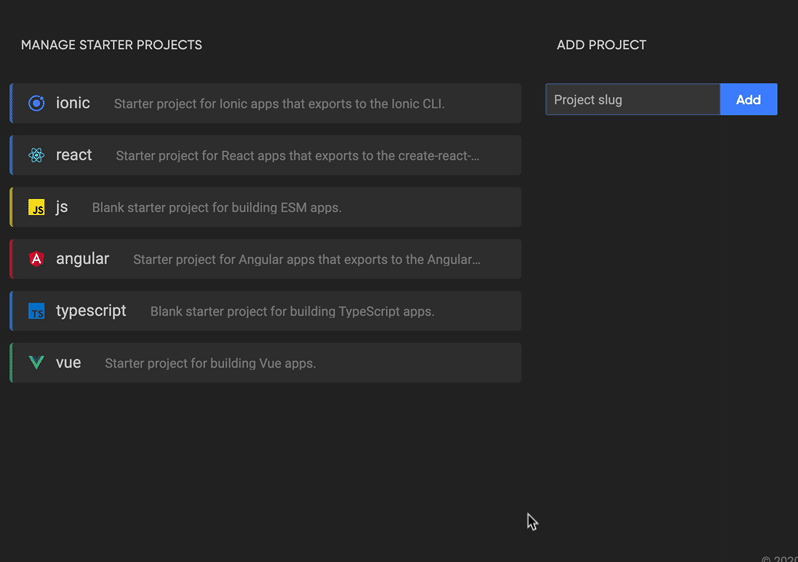

# {{ $frontmatter.title }}

:::info
Creating, updating and managing starter projects is currently only available in [StackBlitz Enterprise Edition](/enterprise/overview).
:::

When working on a team, you'll likely want to customize the default starter projects that show up on the StackBlitz dashboard. Sharing common templates that are always one-click away enables seamless prototyping, debugging, and experimentation with your company's design system & internal libraries.

## Creating new starter projects

Before starting, make sure that your account [has been granted admin privileges](/enterprise/user-management). This enables you to customize which starter projects show up on your team's dashboard.

Once your account has been granted admin access, you can create new starter projects that show up on your team's dashboard with the following steps:

### 1. Fork a base template

To create a new starter project, first fork one of the default project templates that ship with StackBlitz EE.

At the time of this writing these include:

- **Angular**, which is based on `@angular/cli`
- **React**, which is based on `create-react-app`
- **Ionic**, which is based on `ionic-cli`
- **Vue**, which is based on `@vue/cli`
- **Typescript**, which is based on `tsc`
- **JavaScript**, which is based on JS enabled `tsc`

### 2. Scaffold out the project's code

In your newly forked project, you can now start adding dependencies and creating files/folders relevant to your starter project.

If you have existing files and folders on your local computer that you wish to use, [drag and drop them](/guides/user-guide/importing-projects#upload-from-your-computer) into the editor and they'll automatically be imported.

### 3. Give your project a unique slug

At the top of the editor, choose a unique name for this starter project. This will be the project's canonical "slug" ID that we'll use for adding it to the dashboard.

For example, a forked Angular project will have a slug that looks like this:

So if we're creating a custom starter project for our company's internal design system, we might rename it to this:

### 4. Add your new starter project to the dashboard

To make this template available to your team, go to your StackBlitz dashboard and click the "Customize starter projects" link at the top right above the starter projects section:

> If you don't see this link, your account likely needs to be [granted admin privileges](/enterprise/user-management).

Then, in the sidebar of that page paste in the project's slug ID and click "add":

> Protip: On this page, you can also drag to reorder the starter projects as they will appear on the dashboard.

When you navigate back to your dashboard, you should now see your starter project listed! Any time you and your team members click this link, it will automatically create a fresh fork of your starter project.

## Updating your starter projects

To update the code of your starter projects, navigate to the starter project's URL and make the desired changes.

After clicking save, the starter project will automatically be updated and any subsequent forks will be based on the new version of the project.