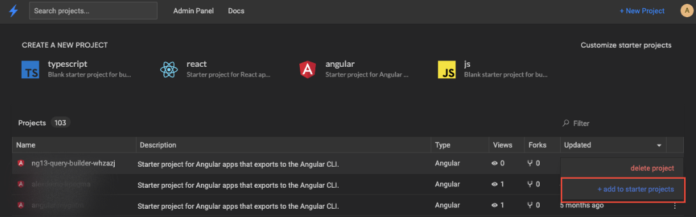
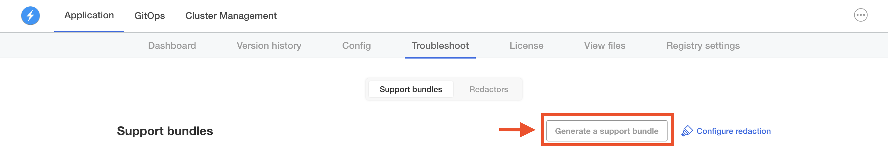

# {{ $frontmatter.title }}

:::info
Creating, updating and managing starter projects is currently only available in [StackBlitz Enterprise Edition](/enterprise/overview).
:::

When working on a team, you'll likely want to customize the default starter projects that show up on the StackBlitz dashboard. Sharing common templates that are always one-click away enables seamless prototyping, debugging, and experimentation with your company's design system & internal libraries.

## Creating new starter projects

Before starting, make sure that your account [has been granted admin privileges](/enterprise/user-management). This enables you to customize which starter projects show up on your team's dashboard.

Once your account has been granted admin access, you can create new starter projects that show up on your team's dashboard with the following steps:

### 1. Fork a base template

To create a new starter project, first fork one of the default project templates that ship with StackBlitz EE.

At the time of this writing these include:

- **Angular**, which is based on `@angular/cli`
- **React**, which is based on `create-react-app`
- **Ionic**, which is based on `ionic-cli`
- **Vue**, which is based on `@vue/cli`
- **Typescript**, which is based on `tsc`
- **JavaScript**, which is based on JS enabled `tsc`

### 2. Scaffold out the project's code

In your newly forked project, you can now start adding dependencies and creating files/folders relevant to your starter project.

If you have existing files and folders on your local computer that you wish to use, [drag and drop them](/guides/user-guide/importing-projects#upload-from-your-computer) into the editor and they'll automatically be imported.

### 3. Give your project a unique slug

At the top of the editor, choose a unique name for this starter project. This will be the project's canonical "slug" ID that we'll use for adding it to the dashboard.

For example, a forked Angular project will have a slug that looks like this:

So if we're creating a custom starter project for our company's internal design system, we might rename it to this:

### 4. Add your new starter project to the dashboard

To make this template available to your team, go to your StackBlitz dashboard and click the "Customize starter projects" link at the top right above the starter projects section:

> If you don't see this link, your account likely needs to be [granted admin privileges](/enterprise/user-management).

Then, in the sidebar of that page paste in the project's slug ID and click "add":

> Protip: On this page, you can also drag to reorder the starter projects as they will appear on the dashboard.

When you navigate back to your dashboard, you should now see your starter project listed! Any time you and your team members click this link, it will automatically create a fresh fork of your starter project.

You can also add previously opened projects to your starter projects. Navigate to the main dashboard and click on the three vertical dots to the right of the project. Click on `+ add to starter projects` to add that specific project to your starter projects.

## Updating your starter projects

To update the code of your starter projects, navigate to the starter project's URL and make the desired changes.

After clicking the "Save" button, the starter project will automatically be updated and any subsequent forks will be based on the new version of the project.

## How to create a "polymer-based" (Static HTML/CSS/JS) project preset in Enterprise

### What is a "polymer-based" project?

StackBlitz supports a specific type of [EngineBlock-based](https://developer.stackblitz.com/guides/user-guide/available-environments) project which uses a Service Worker to have the browser serve project files as-is and back to itself in the preview.

This can be useful for making simple HTML, CSS and JavaScript demos with no npm dependencies and no JavaScript code transpilation.

Here's an example on stackblitz.com: [https://stackblitz.com/edit/web-platform](https://stackblitz.com/edit/web-platform).

### Creating a "polymer-based" project in StackBlitz EE

To be able to use the StackBlitz SDK to create projects with the `template: 'polymer'` option (which selects the `polymer` preset), the target EE instance must have a project with the slug `polymer-base` and the preset `polymer`.

Database seeds for StackBlitz EE don't create this project currently, so let's make one.

The steps below require having admin rights to your StackBlitz EE instance, because we'll use the admin panel to tweak the created project.

1. In the current StackBlitz project, go to `index.ts` and change the `const origin = "…"` value to point to your EE instance.
2. In the preview iframe, click the "Create static HTML project" button.

This should create a temporary project (not yet saved to the database) using the `javascript` preset. If you see an error in the preview window at this stage, that's normal and should not be a problem.

3. On this temporary project in your StackBlitz EE instance, click the “Fork” button to save this project to the database.
4. Edit the forked project's slug to: `polymer-base`.
5. Finally, go to `https://{your-instance}/admin/projects/polymer-base/edit` and change the value of the “Preset” field from `esm` to `polymer`, and save the project.

You should now have a project with the `polymer` preset and whose slug is `polymer-base`. Don't touch this project in the future (you can make it “frozen” in the [project settings](/guides/user-guide/ide-whats-on-your-screen#settings-sidebar) in the editor to prevent accidental changes) to make sure the SDK functionality works well.

You can add this project to the list of starters on `https://{your-instance}/starters`.

If you want to use a different project slug than `polymer-base`, for example `static-html`, so that forked projects are named `static-html-yzn94i` rather than `polymer-yzn94i`, we recommend forking the `polymer-base` project, naming the fork `static-html`, and using that fork in the starters list instead of the `polymer-base` project.

## How to generate a support bundle

:::warning Having trouble loading a project? Need to create a support bundle?

A support bundle provides specific logs and analysis that helps our team to troubleshoot to better assist you. We recommending following the steps outline in [Replicated's "Generating Support Bundles" docs](https://docs.replicated.com/enterprise/troubleshooting-an-app) to generate a support bundle via the kots dashboard.
:::

Navigate to the kots dashboard and click on the Troubleshoot tab at the top.

