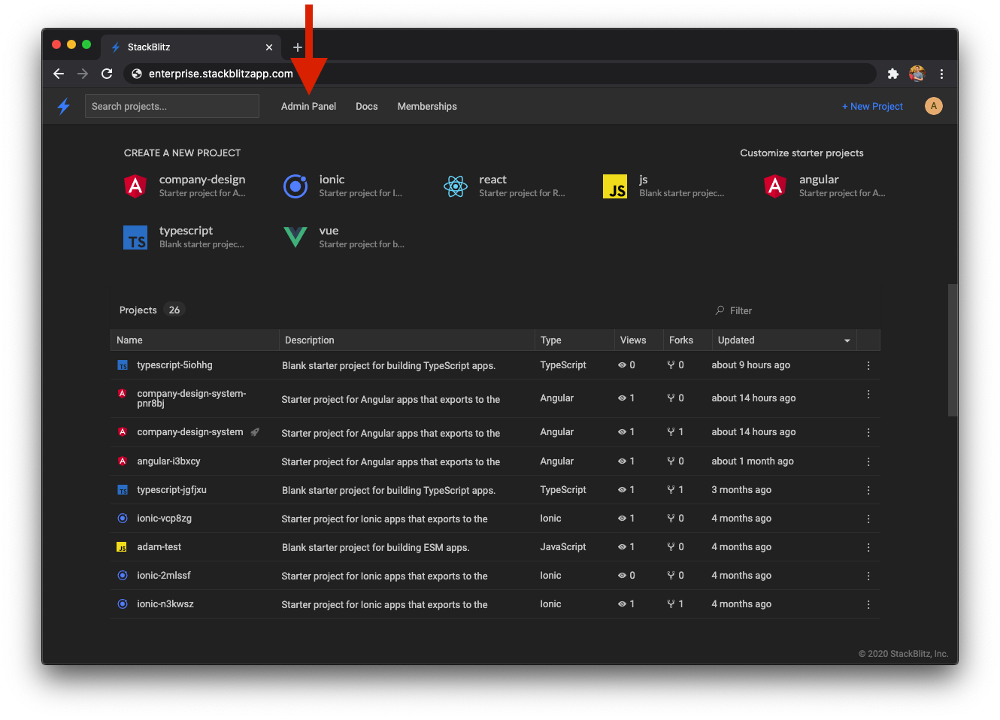
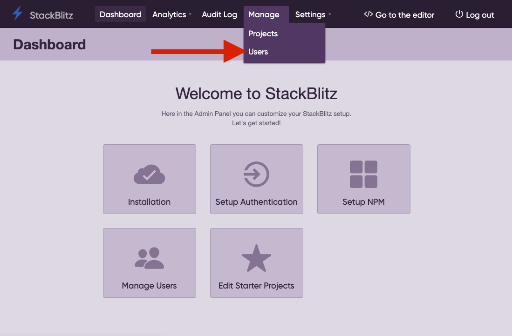
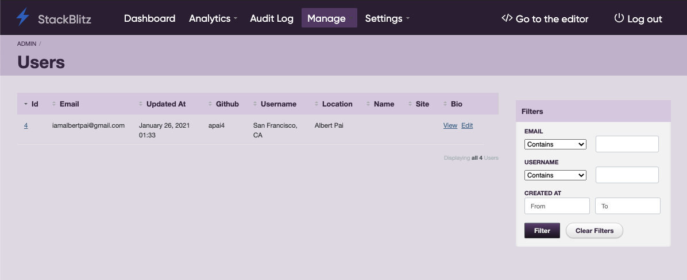
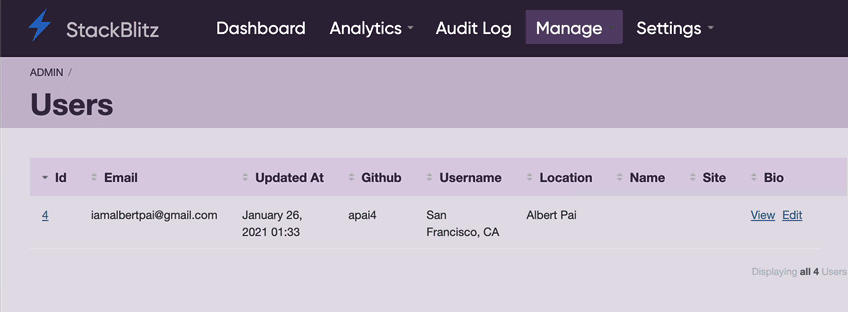

# {{ $frontmatter.title }}

## Grant Admin Access to SSO Accounts

After successful installation, StackBlitz EE comes with a single admin account that can be used for site administration. However, you'll likely want to grant admin access to at least one SSO-based account if you plan on using [custom starter projects](/guides/user-guide/starter-projects).

You can do this with the following steps:

### 1. Sign in with your non-admin SSO account.

This ensures that your SSO account is registered within the StackBlitz EE database and can be upgraded to an admin account.

**Before proceeding to the next step, sign out of this account**. At the top right of the dashboard, click the user icon and select "Sign out".

### 2. After signing out, sign in using the default admin account.

The credentials for the default admin account should have been provided to you by the StackBlitz Enterprise team during the installation process.

Upon signing in, navigate to the Admin Panel using the link in the dashboard's header:

### 3. Grant admin access to your SSO account

On the Admin Panel dashboard, hover over the "Manage" tab and click on "Users":

You can use the "Filters" sidebar to search for your account by either your email address or username:

Once you've located your account, click the "Edit" link and upgrade your account to be an admin user:

With this step completed, you can now sign out of the default admin account and sign in using your SSO account which now has admin access. Your account can now customize your team's starter projects as well as grant admin access to additional SSO accounts.
