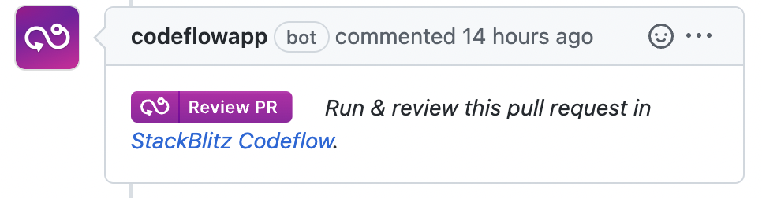

# {{ $frontmatter.title }}

This page covers integrating CodeflowApp Bot into your project.

## What is CodeflowApp Bot?

<!--@include: ./parts/codeflowapp-bot.md-->

Once integrated, it will appear on your PRs and issues containing StackBlitz reproduction:



## Integrating CodeflowApp Bot

To integrate CodeflowApp bot, you will install it using GitHub UI.

1. Visit [CodeflowApp profile on GitHub Marketplace](https://github.com/amarketplace/codeflowapp)
2. Select the account or organization, as well as the repositories you want to enable the bot in. 
  -  If you choose “all in Organization”, CodeflowApp bot will install on all repositories in your organization.
  - Please don't worry - if you change your mind, you can change the bot access or completely disable it!

<!--@include: ./parts/installing-codeflowapp.md-->

## Disabling CodeflowApp Bot

Once installed, the bot will be enabled by default on the repository and will be triggered whenever there is a new PR or an issue.

To disable the bot:

1. Create `.stackblitz` folder in the root directory of the project.
2. Inside this folder, create a file called `codeflow.json`, specifying which actions you want disabled:

```json
// .stackblitz/codeflow.json

"bot": {
    "issues": {
        "enabled": false
    },
    "pullRequests": {
        "enabled": false
    }
}
```

Alternatively, you can also pause or uninstall the bot [through the GitHub UI](https://docs.github.com/en/developers/apps/managing-github-apps/deleting-a-github-app).

