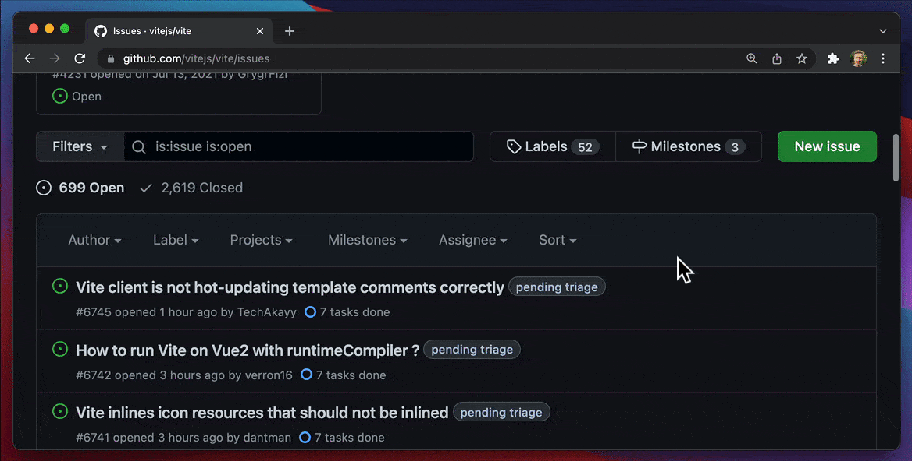

# {{ $frontmatter.title }}

## Issue-reporting workflow

> A well-described issue is immensely helpful when developing a software product, and a minimal reproduction is one of the most useful part of the conversation.

How can we encourage users to provide bug reproductions in a smart way?

You can use GitHub's [issue templates](https://docs.github.com/en/communities/using-templates-to-encourage-useful-issues-and-pull-requests/configuring-issue-templates-for-your-repository) for that, but what's even more engaging is their new [issue forms](https://docs.github.com/en/communities/using-templates-to-encourage-useful-issues-and-pull-requests/configuring-issue-templates-for-your-repository#creating-issue-forms) feature. For instance, this is how Vite team is using it:



You can also configure a GitHub workflow where assigning a specific label to the issue automatically adds a relevant comment asking for a reproduction. Here's an [example from the Vite repository](https://github.com/vitejs/vite/blob/1248b62b9d09b10ce5ea7703d907d69d2167fdca/.github/workflows/issue-labeled.yml#L31):

```yaml
name: Issue Labeled

on:
  issues:
    types: [labeled]

jobs:
  reply-labeled:
    runs-on: ubuntu-latest
    steps:
      - name: need reproduction
        if: github.event.label.name == 'need reproduction'
        uses: actions-cool/issues-helper@v2
        with:
          actions: 'create-comment, remove-labels'
          token: ${{ secrets.GITHUB_TOKEN }}
          issue-number: ${{ github.event.issue.number }}
          body: |
            Hello @${{ github.event.issue.user.login }}. 
            Please provide a [minimal reproduction](https://stackoverflow.com/help/minimal-reproducible-example) 
            using a GitHub repository or [StackBlitz](https://vite.new).
            Issues marked with `need reproduction` will be closed if they have no activity within 3 days.
          labels: 'pending triage'
```

## How to help users in creating a reproduction?

In order to reduce the friction when creating a bug reproduction, you can create a starter project that your users will be able to instantly launch, edit, and add to the issue.

💡 Read all about running projects from GitHub in the [GitHub Importer Guide](/guides/integration/open-from-github).

:::info How can we improve this guide?
Haven't found an answer to your question? [Let us know!](mailto:devrel@stackblitz.com)
:::
