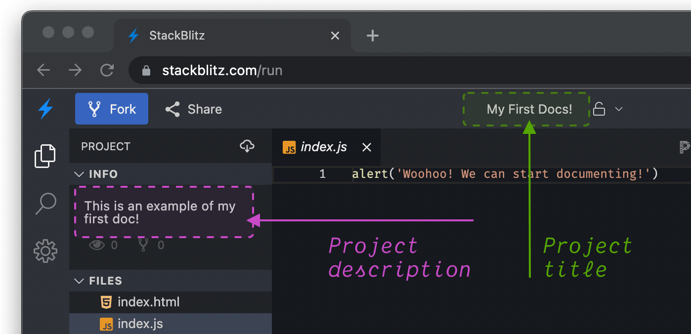

<script setup lang="ts">
import sdk from '@stackblitz/sdk';
import InlineButton from '@theme/components/InlineButton.vue';

function openProjectDemo() {
  sdk.openProject(
    {
      files: {
        'index.html': `<h1>Hello world!</h1>`,
        'index.js': `alert('Woohoo! We can start documenting!')`,
      },
      template: 'javascript',
      title: `My First Docs!`,
      description: `This is an example of my first doc!`,
    },
    {
      newWindow: true,
    }
  );
}
</script>

# {{ $frontmatter.title }}

Sometimes, instead of keeping a set of example project in a GitHub repository, it is more convenient to create them dynamically on the fly. This is often the case when you maintain a documentation with code snippets that you want your users to open in a live environment.

In order to create a project on-demand, use our [SDK](https://www.npmjs.com/package/@stackblitz/sdk). It is a small package (just 2kb gzipped) intended to help in communication between your code and StackBlitz.

This page will guide you through the SDK setup and available options. You can also take a look at [the demo project](#demo) at the end of this page.

## Setup

To add the StackBlitz SDK to your project, run `npm install @stackblitz/sdk` in the terminal or add this script to your page:

```html
<script
  src="https://unpkg.com/@stackblitz/sdk/bundles/sdk.umd.js">
</script>
```

This will give you the access to the global `StackBlitzSDK` JavaScript object, which you can use to create projects and even send additional commands to the environment, for example to update it or change the active file.

## Creating a new project

To create a new project and open it in the same (or different) tab, you will use the `openProject` method, which accepts two arguments:

- a payload object,
- an options object (optional).

For example, here is a new project that will render a “Hello World” header and then run an alert. If you want to see it yourself, click the following button: <InlineButton @click="openProjectDemo">Open project in new tab</InlineButton>

```js
StackBlitzSDK.openProject(
  // Payload
  {
    files: {
      'index.html': `<h1>Hello world!</h1>`,
      'index.js': `alert('Woohoo! We can start documenting!')`,
    },
    template: 'javascript',
    title: `My First Docs!`,
    description: `This is an example of my first doc!`,
  },

  // Options
  {
    newWindow: true
  }
);
```

## Payload: the contents and crucial settings

Let’s take a look at some of the most crucial parts of the payload first.

```js
{
  files: {
    `file1Path`: `file1Content`,
    `file2Path`: `file2Content`,
    /* ... */
  },
  template: `projectTemplateName`;
  /* ... the rest of the payload ... */
}
```

### Files

`files` is a flat JavaScript object where each key represents a path, and each value is the file's contents.
For example: in order to create a project with a `readme.md` file and `src` folder that contains `index.js` file inside, your `files` would look something like this:

```js
{
  files: {
    `readme.md`: `# Welcome to the demo`,
    `src/index.js`: `console.log('Hello, demo!')`
  }
}
```

For a more extensive example [see this Gist](https://gist.github.com/sulco/df406c4f658121875bcf2d62d112545a).

### Template

`template` defines a way StackBlitz environment will build the project. There are two options to choose from:
- a preconfigured custom setup dedicated to specific technology such as `angular-cli` or `create-react-app`,
- `node`, a WebContainers environment where you decide how your app example will be built, for instance with Vite or webpack.

You can find the [full list of available templates here](/platform/api/javascript-sdk#supported-project-types).

```js
{
  template: 'javascript'
}
```

### Dependencies

`dependencies` allow you to specify the list of the libraries your project needs similarly to how they are listed in the `package.json` file. Here is an example `dependencies` entry:

```js
{
  dependencies: {
    lodash: "3.8",
    react: "17"
  }
}
```

### Title and Description

Now that you have the content of your project defined, it is useful to provide some explanation for your users to see when the environment opens. That's where the `title` and `description` properties come in handy:

```js
{
  title: `My First Docs!`,
  description: `This is an example of my first doc!`
}
```

This is how the title and description look inside a StackBlitz project:



## Options: Customizing your project

To further customize your project, you can provide a second argument to the `StackBlitzSDK.openProject` method. The argument is an object that allows to provide optional adjustments:

- **`openFile`** – StackBlitz displays a file in the editor on page load - depending on a project, that would usually be a readme or the index file. You can specify the featured file:
    ```js
    {
      openFile: 'src/app/index.tsx'
    }
    ```
- **`newWindow`** – By default, the project will be opened in a new browser window. To open in the same one, set this parameter to `false`:
    ```js
    {
      newWindow: false
    }
    ```
- **`hideDevTools`** – Projects that are not powered by WebContainers feature a small console located next to the editor you can use to log things for your users without them needing to open the browser's DevTools. To hide it, set `hideDevtools` to `true`:
    ```js
    {
      hideDevTools: true
    }
    ```
- **`devToolsHeight`** - the console in the preview window is set to take 33% of the window's height (in the projects not powered by WebContainers). You can change its height:
    ```js
    {
      devToolsHeight: 50
    }
    ```
- **`initialPath`** – Set the path to be opened by the preview window:
    ```js
    {
      initialPath: '/posts'
    }
    ```
- **`origin`** – If you are using StackBlitz Enterprise Edition on-premise, this setting will allow you to set the origin URL of your StackBlitz EE server:
    ```js
    {
      origin: 'https://our-sb-instance.internal.excellent-company.com'
    }
    ```

## Demo

:::tip DEMO
Check this demo of creating a project with StackBlitz SDK through an npm install:

- [TypeScript demo](https://stackblitz.com/edit/sdk-create-project-with-npm-ts)
- [JavaScript demo](https://stackblitz.com/edit/sdk-create-project-with-npm-js)

or through [loading the UMD bundle](https://stackblitz.com/edit/sdk-create-project-with-script-js).
:::

---

:::info Can we improve this guide?
Haven't found an answer to your question? [Let us know!](mailto:devrel@stackblitz.com)
:::
