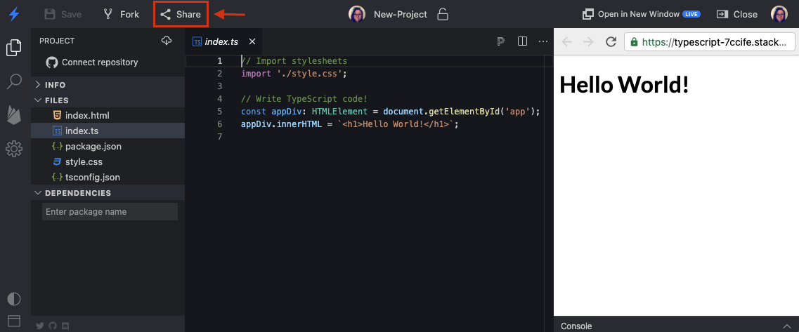

# {{ $frontmatter.title }}

Embedding is one way to display a StackBlitz editor in a documentation page, a blog post, or any other page. This page covers manual embedding in iframes. You can also do it [programmatically by using our SDK](/guides/integration/create-with-sdk).

## Embedding StackBlitz project on a page

**1.** Open a project of your choosing and click the "Share" button in the top left navigation bar:



**2.** In the popup window, choose the "Embed" tab. Customize your embed by choosing appropriate options from the panel on the right and check the preview on the bottom to see how your embed will look. If you're satisfied, copy the embed URL.


:::tip
You can customize your embed further by adding suitable [query parameters](#embed-url-options).
:::

**3.** Paste the embed URL into the desired iframe:

```html
<iframe src="https://stackblitz.com/edit/angular?embed=1"></iframe>
```

You can also embed StackBlitz projects into [Medium or Dev posts](#embedding-on-blogging-sites).

## Embedding StackBlitz projects on blogging sites {#embedding-on-blogging-sites}

StackBlitz embeds are supported on DEV and Medium and accept the [embed URL options](#embed-url-options).

### DEV

To embed a StackBlitz project in DEV, take your project URL and use it inside the DEV's liquid tag, like so:

```liquid

```

### Medium

To embed a StackBlitz project in Medium, take your project URL (for instance: https://stackblitz.com/edit/angular) and paste it. After you hit enter, it should automatically become an embed.

## Embed URL options

You can use the following URL query parameters to customize the appearance and functionality of the embedded project:

| Parameter |               Value               |               Description               |
|-----------|-----------------------------------|-----------------------------------------|
|`ctl`| `0`/`1` | Prompts users to “click to load” the embed. |
| `devtoolsheight` | `0` - `100` | Sets the height of [the console][ui_docs] in the editor preview. |
| `embed` |  `0`/`1` | Forces embed view regardless of screen size. |
| `file` | file path | Specifies the default file to have open in the editor. |
| `hidedevtools` |  `0`/`1` | Hides [the console][ui_docs] in the editor preview. |
| `hideExplorer` |  `0`/`1` | Hides the [file explorer pane][ui_docs] in embed view. |
| `hideNavigation` | `0`/`1` | Hides the preview’s URL bar. |
| `initialpath` | URL path | Specifies the initial URL path (URI encoded) the preview should open. |
| `showSidebar` | `0`/`1` | Shows the sidebar in embed view (large viewports only) |
| `terminal` | string | Specifies the npm script to run on project load ([WebContainers-based projects][available_env_docs] only). |
| `terminalHeight` | `0` - `100` | Sets the height of [the terminal][ui_docs]. |
| `theme` | `light` - `dark` | Sets the color theme of the editor UI. |
| `view` | `editor` - `preview` | Specifies which view to open by default. |

Alternatively, you can use our [JavaScript SDK methods](/platform/api/javascript-sdk) for embedding StackBlitz projects in pages to avoid creating and configuring iframes.


[ui_docs]: /guides/user-guide/ide-whats-on-your-screen
[available_env_docs]: /guides/user-guide/available-environments
