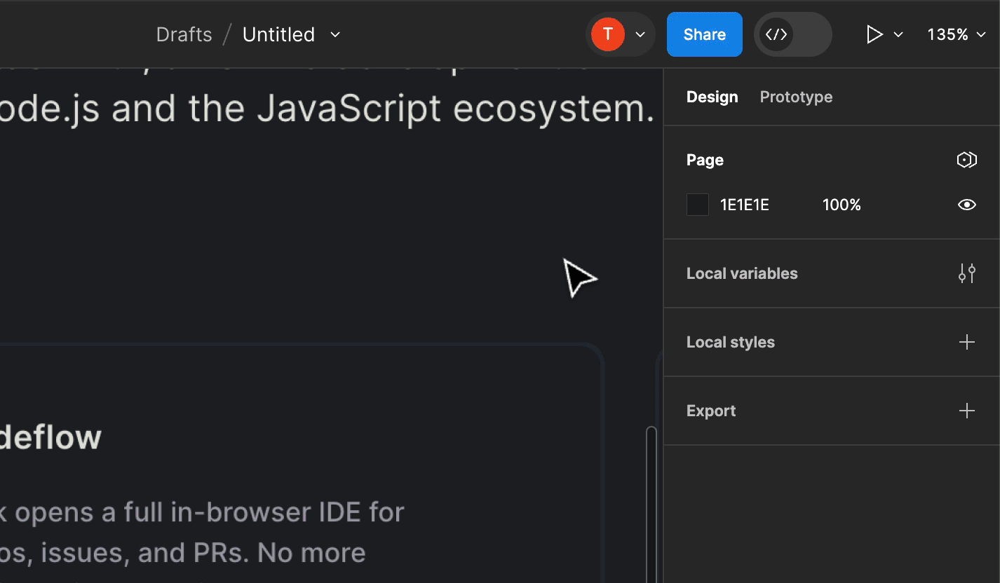
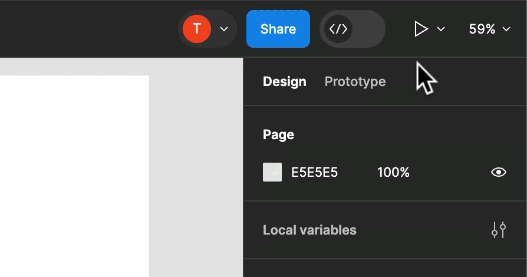

# {{ $frontmatter.title }}

[Figma](https://www.figma.com/) is a collaborative UI/UX design tool. Figma’s [Dev Mode](https://www.figma.com/dev-mode/) enables developers to inspect designs, extract code, and access design details, streamlining the design-to-production process.

Figma supports a [number of plugins](https://www.figma.com/community/category/development/plugins) that extend the functionality and integrate additional tools with the platform.

::: tip Available with all StackBlitz plans including **Personal**, **Personal+**, **Teams**, and **Enterprise**.

The plugin is compatible with all Figma plans.
:::

## About the StackBlitz plugin for Figma

With [StackBlitz’s Figma plugin](https://www.figma.com/community/plugin/1287113487428429346), Dev Mode users can open components in StackBlitz directly from Figma. 

After configuring the plugin, you will be able to:

- Link layers in Figma to specific components in your design system
- Open the relevant components in an instant, browser-based development environment directly from Figma Dev Mode
- View and modify the relevant component in StackBlitz without any local configuration
- Preview any changes live within StackBlitz
- Commit edits back to the repository or open a pull request

## **Installing the plugin**

To use the StackBlitz plugin, add it to a Figma file from either:

- **The [plugins directory](https://www.figma.com/community/plugin/1287113487428429346)** by clicking “Open in…” and then selecting the name of the file.
    
    
    *Initialize the StackBlitz plugin from within Dev Mode.*

- **Dev Mode within your Figma file** by searching for "StackBlitz" under *Plugins*

## Using the StackBlitz plugin with Dev Mode

Once you have added the plugin to your Figma file,

- Enable [Dev Mode](https://www.figma.com/dev-mode/) is on (`Shift` + `D`)
- Select a layer
- Open in the StackBlitz plugin and paste a URL of a repository with the code of your project.
    - You can also use the URL of a specific file within this repository: typically, a component file, for instance: https://github.com/stackblitz/docs/blob/main/.vitepress/theme/components/CardLists/CardList.vue
- Click the "Create instant environment link" button to have the link generated for the selected layer.

The link is now added to the layer's Dev resources.

When you click it, a new tab will open with the full IDE loaded with your project. If your link included a file, this file will already be open in the editor.

### Recommended uses for the plugin

We suggest providing instant environment links, especially for the essential components in your app. The components that might need adjustments in future are good candidates as well.

Generally, every time a developer looks at a component in Figma to make changes in the code, having a resource link handy will make their work so much easier!

For more information, [view the StackBlitz plugin in the Figma community directory](https://www.figma.com/community/plugin/1287113487428429346) and refer to the [Figma Dev Mode documentation](https://help.figma.com/hc/en-us/articles/15023124644247-Guide-to-Dev-Mode).

:::info How can we improve this guide?
Haven't found an answer to your question? [Let us know!](mailto:devrel@stackblitz.com)
:::
