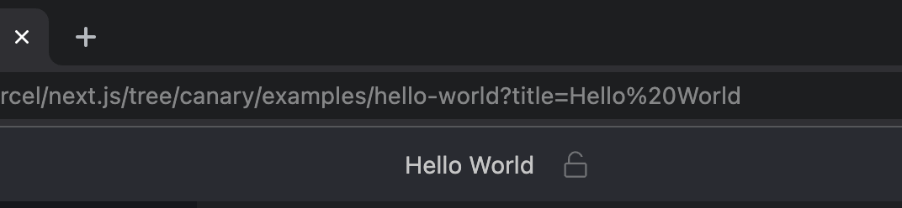

# {{ $frontmatter.title }}

When providing an example for your users to open, there are several things to consider:

- How to display the link?
- What is the actual URL?
- Where to place the code within the repository?
- How to configure the project to give people the best experience?

In the following guide, we will answer all of these questions.

### The “Open in StackBlitz” button

One of the ways to make your code example stand out in your docs or your repository's readme file is to use our CTA (call-to-action) buttons.

| Button preview | Direct URL |
| --- | --- |
|  | <a href="/img/open_in_stackblitz.svg" target="_blank">open_in_stackblitz.svg</a> |
|  | <a href="/img/open_in_stackblitz_small.svg" target="_blank">open_in_stackblitz_small.svg</a> |

::: tip
You can either host on your servers or use our image URLs directly.
:::

In order to display the button in a **Markdown file**, use the following code - remember to replace the last URL with your example’s path:

```md
[](https://stackblitz.com/github/___YOUR_PATH___)
```

If you want to display the button in an **HTML markup**, use the following code:

```html
<a href="https://stackblitz.com/github/___YOUR_PATH___">
  
</a>
```

### Project URL

Projects loaded from GitHub follow this URL template: “stackblitz.com” + “github” + “GitHub username” + “repository name” (and possibly a path to a specific directory, commit, tag or branch), for instance:

- [https://stackblitz.com/github/astro-js/astro-theme-starter](https://stackblitz.com/github/astro-js/astro-theme-starter)
- [https://stackblitz.com/github/remix-run/react-router/tree/main/examples/basic](https://stackblitz.com/github/remix-run/react-router/tree/main/examples/basic)


### Open directly or fork?

Depending on the _“action”_ specified in the import URL (see the section above), the importer will either open the repository or make a fresh copy.

Consider a link like this one - a StackBlitz project loaded from a GitHub repository:

```md
[https://stackblitz.com/github/astro-js/astro-theme-starter](https://stackblitz.com/github/astro-js/astro-theme-starter)
```

In this case, StackBlitz imports the repository but does not give the _write_ access to it. When the user makes some changes to the code and tries to save it, the page will reload, and they will get their own copy of the project with the changes applied.

To save users from seeing the page reload, we recommend always providing the link that will already load a fresh copy by including the `/fork` before the GitHub part of the URL:

```md
[https://stackblitz.com/fork/github/astro-js/astro-theme-starter](https://stackblitz.com/github/astro-js/astro-theme-starter)
```

### Organizing the project in your repository

Since the StackBlitz git importer is able to work with various GitHub paths, you can place your example project in any directory, but the common convention is to have a `/examples` or `/templates` folder in your project’s repository.

Oftentimes such a folder will consist of subfolders with several different variations of a project (for instance, [https://github.com/remix-run/react-router/tree/main/examples](https://github.com/remix-run/react-router/tree/main/examples/basic))

:::info Note
Make sure you don’t use a relative path to the main project in your examples’ `package.json` dependencies. Since what will be imported is only the content of the example’s folder, the example won’t have an access to the external paths.
:::

### Customizing the `title`

By default, the GitHub importer will set the project's title based on the GitHub username and the repository name. As you see below, the name of the project is "Next.js Hello World Example” (in the top center):

```
https://stackblitz.com/github/vercel/next.js/tree/canary/examples/hello-world
```


To customize it, add the `title` argument to the URL like so:

```md
[](https://stackblitz.com/github/vercel/next.js/tree/canary/examples/hello-world?title='Hello World'
)
```

As you see, the title has now changed from “Next.js Hello World Example” to “Hello World”:

```
https://stackblitz.com/github/vercel/next.js/tree/canary/examples/hello-world?title=Hello World
```



### Launching a script on project load

Usually, in your project’s `package.json` file there is a script that you would instruct your users to run in order to, for instance, launch a development server. Suppose your `package.json` includes such `dev` script:

```json
{
	"scripts": {
		"dev": "vite"
	}
}
```

In order to run an [npm script](https://docs.npmjs.com/cli/v8/using-npm/scripts) automatically when the editor opens, you can either:

- provide the `terminal` query parameter:
  ```
  ?terminal=dev
  ```
- create the `.stackblitzrc` file with the `startCommand` option:
  ```json
  {
    "startCommand": "npm run dev"
  }
  ```

## Tips & best practices

### Keep the `package-lock.json` file

Make sure you keep the `package-lock.json` file in your project to optimize the launching speed.

If the `package-lock.json` file exists in the imported project, a package manager doesn't have to do the work needed to resolve dependencies, which takes significant amount of time during the installation process.

### Set up the main starter URL

Create a custom URL that immediately opens the live environment.

Great job: you've set up the starter project that your users can instantly spin up. Now whenever you'd like to quickly demo your framework, you can visit your docs or a "readme.md" file, click the "Open in StackBlitz" button, and load a project.

_But how about we make this even more convenient?_

To reduce the friction for the people who start with your library from scratch, **set up a simple URL that immediately opens the live environment**!

For instance, let's assume your project's homepage is `awesome-lib.com` you can:

- provide an `awesome-lib.new` domain that redirects to the `stackblitz.com/fork/github/awesome-lib/examples/starter` address
- or set up a `/new` path on your current domain, which will also redirect to the starter.

Either `awesome-lib.new` or `awesome-lib.com/new` are both quite handy ways to have your project running in a browser in no time!

Here are some examples of how others are doing it:

- [astro.new](https://astro.new/); for example: [astro.new/blog?on=stackblitz](https://astro.new/blog?on=stackblitz)
- [sveltekit.new](https://sveltekit.new/)
- [vitest.new](https://vitest.new/)
- [vite.new](https://vite.new) + some variations: [vite.new/react](https://vite.new/react), [vite.new/vue](https://vite.new/vue), etc.
- [sli.dev/new](https://sli.dev/new)
- [fakerjs.dev/new](https://fakerjs.dev/new)
