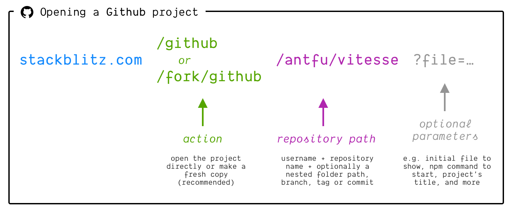

# {{ $frontmatter.title }}

При предоставлении примера для открытия пользователями необходимо учитывать несколько моментов:

- Как отобразить ссылку?
- Каков фактический URL?
- Где разместить код в репозитории?
- Как настроить проект, чтобы дать людям наилучший опыт?

В следующем руководстве мы ответим на все эти вопросы.

### Кнопка "Открыть в StackBlitz"

Один из способов выделить пример кода в документации или файле readme вашего хранилища - использовать наши кнопки CTA (call-to-action).

| Button preview | Direct URL |
| --- | --- |
|  | <a href="/img/open_in_stackblitz.svg" target="_blank">open_in_stackblitz.svg</a> |
|  | <a href="/img/open_in_stackblitz_small.svg" target="_blank">open_in_stackblitz_small.svg</a> |

::: tip
Вы можете разместить их на своих серверах или использовать наши URL-адреса изображений напрямую.
:::

Чтобы отобразить кнопку в **Markdown-файле**, используйте следующий код - не забудьте заменить последний URL на путь вашего примера:

```md
[](https://stackblitz.com/github/___YOUR_PATH___)
```

Если вы хотите отобразить кнопку в **HTML-разметке**, используйте следующий код:

```html
<a href="https://stackblitz.com/github/___YOUR_PATH___">
  
</a>
```

### URL проекта

Проекты, загруженные с GitHub, следуют этому шаблону URL: "stackblitz.com" + "github" + "имя пользователя GitHub" + "имя репозитория" (и, возможно, путь к определенному каталогу, коммиту, тегу или ветке), например:

- [https://stackblitz.com/github/astro-js/astro-theme-starter](https://stackblitz.com/github/astro-js/astro-theme-starter)
- [https://stackblitz.com/github/remix-run/react-router/tree/main/examples/basic](https://stackblitz.com/github/remix-run/react-router/tree/main/examples/basic)



### Открывать напрямую или вилкой?

В зависимости от _"действия"_, указанного в URL импорта (см. раздел выше), импортер либо откроет хранилище, либо создаст свежую копию.

Рассмотрим ссылку, подобную этой - проект StackBlitz, загруженный из репозитория GitHub:

```md
[https://stackblitz.com/github/astro-js/astro-theme-starter](https://stackblitz.com/github/astro-js/astro-theme-starter)
```

В этом случае StackBlitz импортирует хранилище, но не дает к нему доступ на _запись_. Когда пользователь внесет изменения в код и попытается сохранить его, страница перезагрузится, и он получит свою собственную копию проекта с внесенными изменениями.

Чтобы избавить пользователей от необходимости видеть перезагрузку страницы, мы рекомендуем всегда указывать ссылку, которая уже загружает свежую копию, включив `/fork` перед частью URL GitHub:

```md
[https://stackblitz.com/fork/github/astro-js/astro-theme-starter](https://stackblitz.com/github/astro-js/astro-theme-starter)
```

### Организация проекта в вашем репозитории

Поскольку StackBlitz git importer может работать с различными путями GitHub, вы можете разместить свой проект примера в любой директории, но общепринятым является наличие папки `/examples` или `/templates` в репозитории вашего проекта.

Часто такая папка состоит из вложенных папок с несколькими различными вариантами проекта (например, [https://github.com/remix-run/react-router/tree/main/examples](https://github.com/remix-run/react-router/tree/main/examples/basic)).

:::info Note
Убедитесь, что вы не используете относительный путь к основному проекту в `package.json` зависимостях ваших примеров. Поскольку будет импортировано только содержимое папки примера, пример не будет иметь доступа к внешним путям.
:::

### Настройка `заголовка`

По умолчанию импортер GitHub устанавливает название проекта на основе имени пользователя GitHub и имени репозитория. Как вы видите ниже, название проекта - "Next.js Hello World Example" (в центре вверху):

```
https://stackblitz.com/github/vercel/next.js/tree/canary/examples/hello-world
```


Чтобы настроить его, добавьте аргумент `title` в URL следующим образом:

```md
[](https://stackblitz.com/github/vercel/next.js/tree/canary/examples/hello-world?title='Hello World'
)
```

Как вы видите, заголовок теперь изменился с "Next.js Hello World Example" на "Hello World":

```
https://stackblitz.com/github/vercel/next.js/tree/canary/examples/hello-world?title=Hello World
```


### Запуск скрипта при загрузке проекта

Обычно в файле `package.json` вашего проекта содержится скрипт, который вы поручаете запустить пользователям, чтобы, например, запустить сервер разработки. Предположим, что ваш `package.json` включает такой скрипт `dev`:

```json
{
	"scripts": {
		"dev": "vite"
	}
}
```

Чтобы запустить [npm скрипт](https://docs.npmjs.com/cli/v8/using-npm/scripts) автоматически при открытии редактора, вы можете либо:

- предоставить параметр запроса `терминал`:
  ```
  ?terminal=dev
  ```
- создать файл `.stackblitzrc` с опцией `startCommand`:
  ```json
  {
    "startCommand": "npm run dev"
  }
  ```

## Tips & best practices

### Сохраните файл `package-lock.json`

Убедитесь, что вы сохранили файл `package-lock.json` в вашем проекте для оптимизации скорости запуска.

Если файл `package-lock.json` существует в импортируемом проекте, менеджеру пакетов не нужно выполнять работу по разрешению зависимостей, которая занимает значительное количество времени в процессе установки.

### Настройте основной стартовый URL

Создайте пользовательский URL-адрес, который сразу же открывает живую среду.

Отличная работа: вы создали стартовый проект, который ваши пользователи могут мгновенно запустить. Теперь, когда вы захотите быстро продемонстрировать свой фреймворк, вы можете обратиться к документации или файлу "readme.md". файл, нажмите кнопку "Открыть в StackBlitz". и загрузите проект.

Но как насчет того, чтобы сделать это еще более удобным?

Чтобы уменьшить трудности для людей, которые начинают работать с вашей библиотекой с нуля, **установите простой URL, который сразу открывает живую среду**!

Например, предположим, что домашней страницей вашего проекта является `awesome-lib.com`:

- предоставить домен `awesome-lib.new`, который перенаправляет на адрес `stackblitz.com/fork/github/awesome-lib/examples/starter`.
- или установите путь `/new` на вашем текущем домене, который также будет перенаправлять на стартовый.

Либо `awesome-lib.new`, либо `awesome-lib.com/new` - оба удобные способы быстро запустить ваш проект в браузере!

Вот несколько примеров того, как это делают другие:

- [sveltekit.new](https://sveltekit.new/)
- [vitest.new](https://vitest.new/)
- [vite.new](https://vite.new) + some variations: [vite.new/react](https://vite.new/react), [vite.new/vue](https://vite.new/vue), etc.
- [sli.dev/new](https://sli.dev/new)
- [fakerjs.dev/new](https://fakerjs.dev/new)
