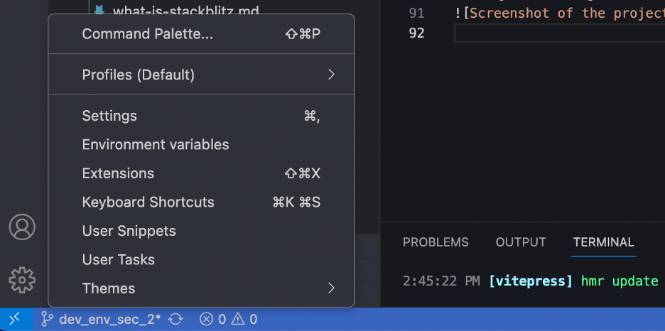
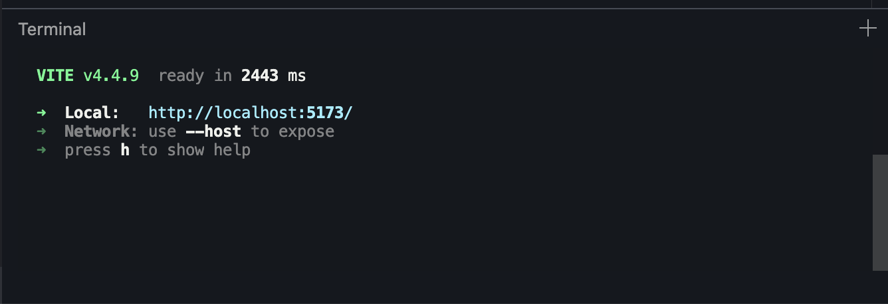
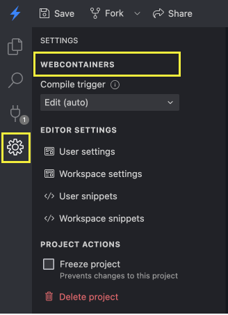
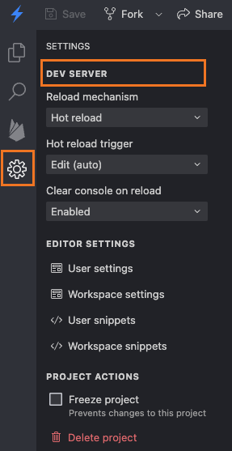
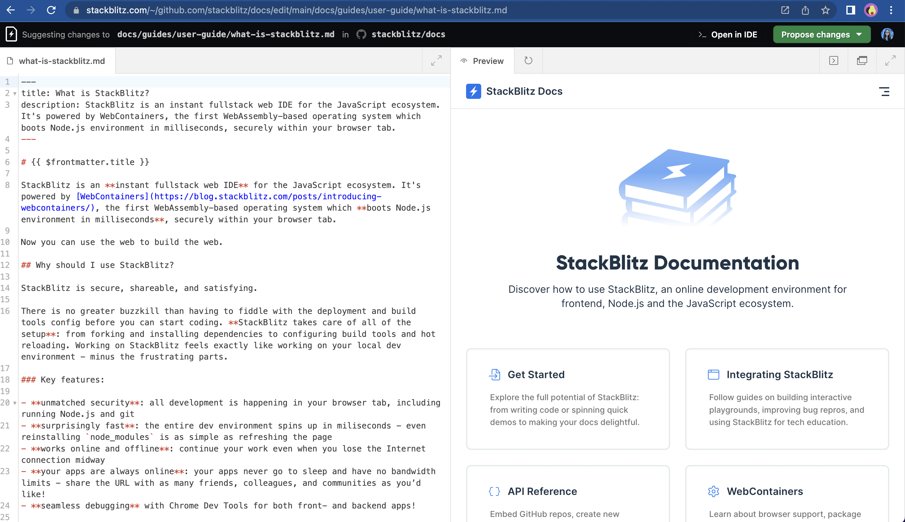

# {{ $frontmatter.title }}

There are two underlying compute environments that can be used to power a StackBlitz project: **EngineBlock** or **WebContainers**. Each project in StackBlitz runs on one of these compute environments. This docs page is designed to describe some of the technical differences between the environments and help you [determine which compute environment you are using](#which-compute-environment-are-you-using).

Depending on the compute environment and choice of editor, StackBlitz will have slightly different features and User Interface elements. See an overview of both compute environments in the table below - and you can directly consult the section on [EngineBlock](#engineblock) or [WebContainers](#webcontainers) for more specifics on each.

| Feature | EngineBlock | WebContainers |
| --- | --- | --- |
| Supported frameworks | <SupportIcon value="star-half" label="" /> Front-end | <SupportIcon value="star" label="" /> Front-end & back-end |
| Supported package managers | <SupportIcon value="star-half" label="" /> Turbo v1 | <SupportIcon value="star" label="" /> npm, pnpm, yarn v1 |
| Full Node.js environment | <SupportIcon value="no" label="Not available" /> | <SupportIcon value="yes" label="Available" /> |
| Shareable preview URL | <SupportIcon value="yes" label="Available" /> | <SupportIcon value="no" label="Not available" /> |
| [Console](/guides/user-guide/user-interface#console) | <SupportIcon value="yes" label="Available" /> | <SupportIcon value="no" label="Not available" /> |
| [Terminal](/guides/user-guide/user-interface#terminal) | <SupportIcon value="no" label="Not available" /> | <SupportIcon value="yes" label="Available" /> |
| ***Editor Support*** |  |  |
| [Classic Editor](/guides/user-guide/getting-started) | <SupportIcon value="yes" label="Available" /> | <SupportIcon value="yes" label="Available" /> |
| [Stackblitz Editor](/guides/user-guide/working-in-stackblitz-editor) | <SupportIcon value="no" label="Not available" /> | <SupportIcon value="yes" label="Available" /> |
| [Web Publisher](/guides/user-guide/content-updates-with-web-publisher) (beta) | <SupportIcon value="no" label="Not available" /> | <SupportIcon value="yes" label="Available" /> |

To explore these differences in practice, we took a React project in the Classic Editor and turned it into:

- [a React project running on EngineBlock](https://stackblitz.com/fork/react)
- [a React project running on WebContainers](https://vite.new/react) (powered by [Vite](https://vitejs.dev/))

## EngineBlock
EngineBlock is StackBlitz's original compute environment, developed in 2017. It operates as a lightweight custom runtime built on top of [SystemJS](https://github.com/systemjs/systemjs#systemjs) and is tailored for CodePen++ type use-cases. Unlike WebContainers, EngineBlock is focused solely on supporting popular front-end frameworks and libraries and does not support full Node.js applications. EngineBlock's main strength is how easily it can be embedded in blogs, documentation, and other web-based mediums, making it an excellent tool for tutorials, demos, and code samples.

**Technical Characteristics**  
EngineBlock uses polyfills linked to browser service workers to emulate various system functions. Due to this polyfilled architecture, it requires custom configurations to support different front-end frameworks. For instance, you can't run a React project using an Angular template in this environment.

**Framework Support**  
While EngineBlock is capable of running popular front-end frameworks, it does so with specific limitations dictated by its polyfill-based architecture. Each framework requires custom settings under the hood to function correctly and full Node.js servers are not supported.

**Package Manager Compatibility**  
EngineBlock supports Turbo v1 for package management, a custom package manager developed specifically for StackBlitz.

**Editor Support**   
EngineBlock is only available in the StackBlitz Classic Editor.

## WebContainers
WebContainers is StackBlitz's next-generation compute environment, launched in May 2021. Unlike EngineBlock, it provides a native Node.js environment, enabling a more flexible and powerful development experience. It's particularly well-suited for running full-stack web applications and provides a broader range of capabilities, including Node.js back-end development. One of its standout features is the inclusion of a fully functional terminal, similar to what you'd expect in a local development environment.

> 💡 [Read the WebContainers announcement blog post here](https://blog.stackblitz.com/posts/introducing-webcontainers/)

**Technical Characteristics**  
WebContainers offer a native Node.js environment in the browser, making it possible to run both front-end and back-end web frameworks without the limitations associated with polyfills/EngineBlock. For more details on the challenges encountered by our engineering team while developing WebContainers, check out the [Engineering category of our blog here](https://blog.stackblitz.com/categories/engineering/). The WebContainers compute environment can also be consumed headlessly using the [WebContainer API](https://blog.stackblitz.com/posts/webcontainer-api-is-here/), allowing you to develop completely custom UIs on top of this powerful in-browser compute environment.

**Framework Support**  
With WebContainers, you gain the flexibility to work with virtually any front-end or back-end web framework including Webpack and Vite based variants, a big advantage over the limited framework support of EngineBlock. For applications requiring data storage, you can run a simple database right inside WebContainers using [SQLite3](https://blog.stackblitz.com/posts/introducing-sqlite3-webcontainers-support/). Advanced in-browser image processing can be accomplished [using Sharp](https://blog.stackblitz.com/posts/bringing-sharp-to-wasm-and-webcontainers/). With the more [recent addition of WASI support](https://blog.stackblitz.com/posts/announcing-wasi/),WebContainers now also support a variety of traditionaly native desktop languages & tools, including Python, WordPress plugin development, and jq. With much more to come in the future, WebContainers are the recommended StackBlitz compute environment for most present and future workloads.

**Package Manager Compatibility**  
WebContainers natively support all the major package managers including [npm, pnpm, and yarn v1](https://blog.stackblitz.com/posts/announcing-native-package-manager-support/), just like a local development environment. This offers a more production grade approach to managing dependencies compared to EngineBlock's Turbo v1.

**Editor Support**  
WebContainers are available in all StackBlitz editors: [Classic Editor](/guides/user-guide/getting-started), [Stackblitz editor](/guides/user-guide/working-in-stackblitz-editor), and [Web Publisher](/guides/user-guide/content-updates-with-web-publisher).

## Which Compute Environment Are You using?

The [Classic Editor](/guides/user-guide/getting-started) supports both EngineBlock and WebContainers compute environments, wheras the [Stackblitz editor](/guides/user-guide/working-in-stackblitz-editor) and [Web Publisher](/guides/user-guide/content-updates-with-web-publisher) editors only support WebContainers.

If clicking the project settings gear opens the VS Code settings dialouge shown below, you are in the **Codeflow editor** and therefore using **WebContainers**:

If using the **Classic Editor**, the simplest way to determine if you're using the EngineBlock or WebContainers compute environment is to check if there is a terminal, which is only available in **WebContainers**:

For additional verification, you can check the Classic Editor project settings. Click the gear icon on the left panel, and the top of the settings pane will display "WebContainers" for WebContainer-based projects or "Dev Server" for EngineBlock projects. 

_Project settings for a Classic Editor, WebContainer Project:_

_Project settings for a Classic Editor, EngineBlock Project:_

And finally, if you see the simplified editing interface pitcured below, you are using the **Web Publisher** editor and therefore the **WebContainers** compute environment:

