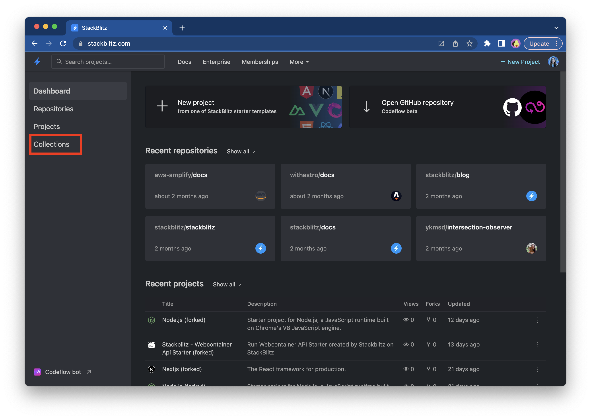
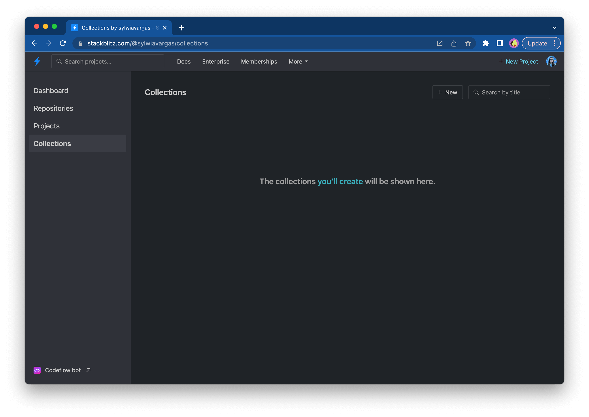
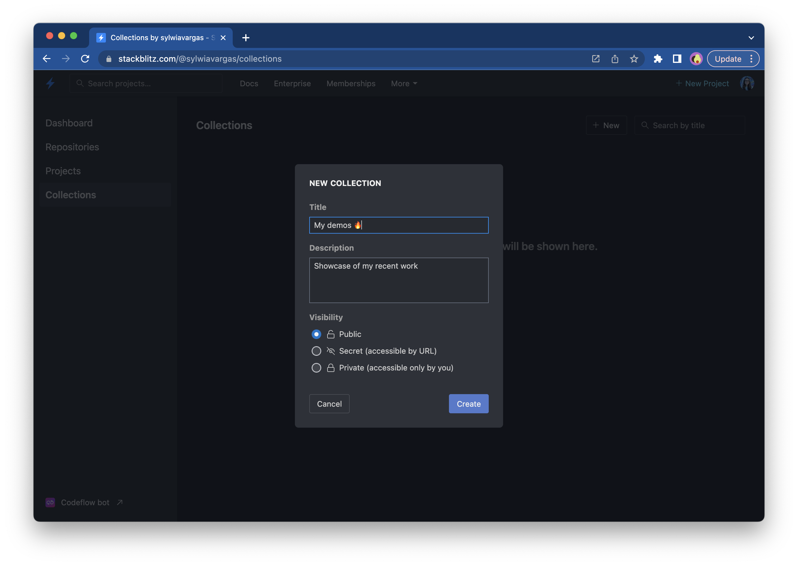
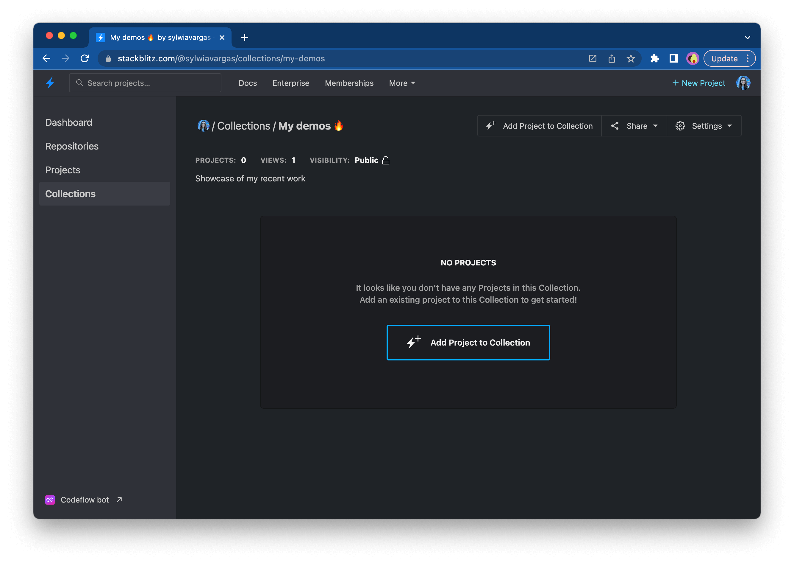
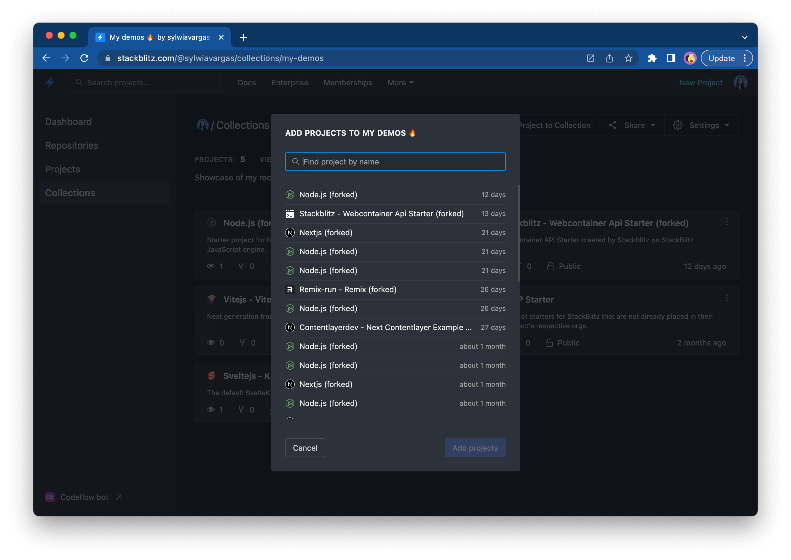
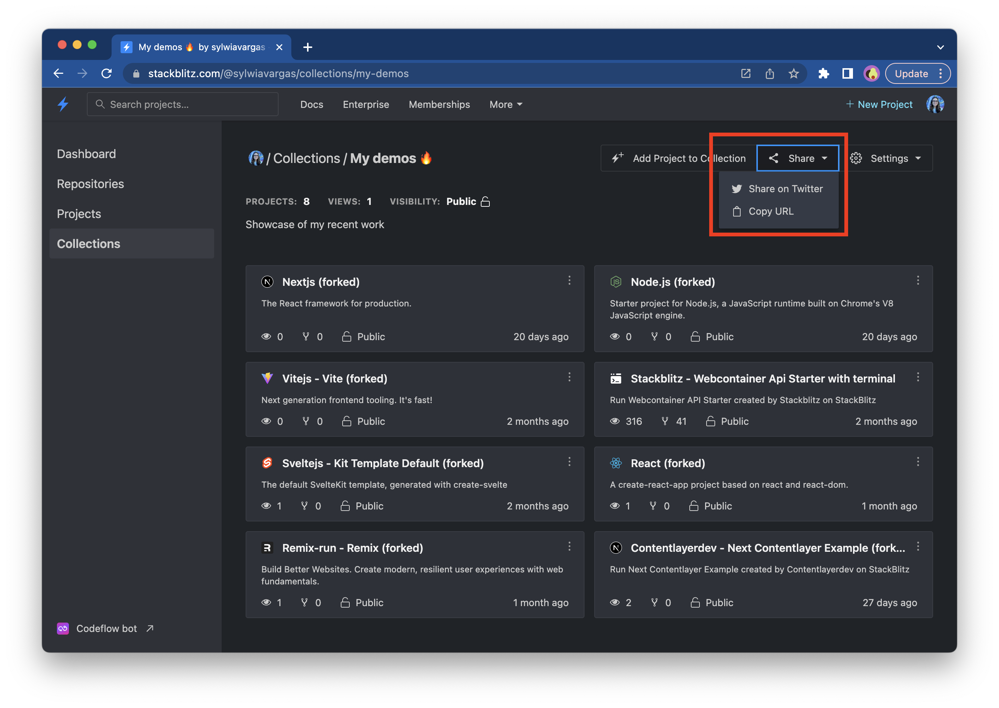

# {{ $frontmatter.title }}

If you'd like to group projects together, you could create a Collection. This feature is helpful when you like to create a list of your demos or inspiring projects you've forked, or can be used as your developer portfolio.

## Creating a new collection

To get started, go to the "Collection" sidebar item from the StackBlitz Dashboard view:

This menu item will open an empty Collections page:

If you click on the "New" button, you will see a modal prompting you to create a new Collection:

## Adding projects to a collection

Once you created a new collection, you will be redirected to its page:

Now you can choose projects which you want to add to the collection:

## Sharing a collection

You can share your collection with friends by either posting it automatically on Twitter or copying its URL. To do so, use the "Share" button on the chosen collection page.

