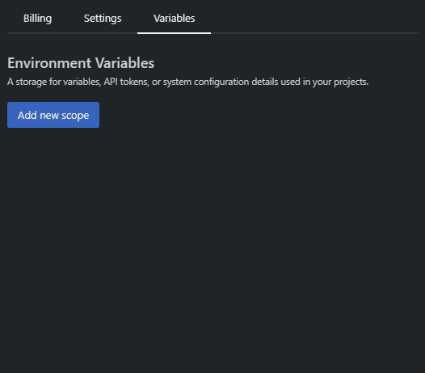
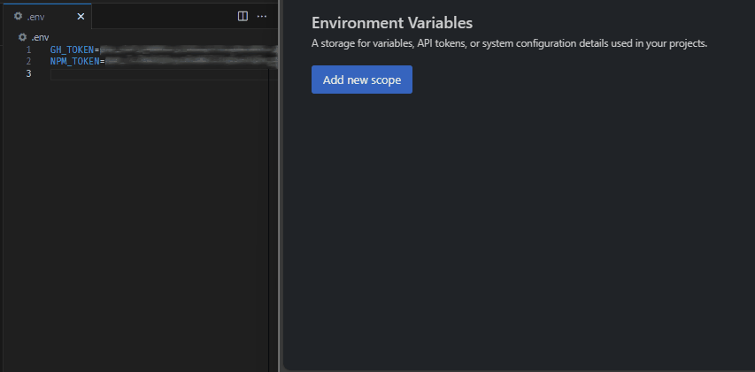

# {{ $frontmatter.title }}

One way to handle reusable configuration data, such as sensitive data, is to use environment variables. These are encrypted values that can be set for each project and each user. This way, you can customize your configuration data without exposing it to others.

### Configuring inside editor (recommended)

On every repo, in the root of your project you will find a special `.env` file. This file can be modified to add new variables or update existing ones, using the [syntax from the dotenv](https://npmjs.com/package/dotenv) package. Changes will be automatically encrypted & synced to the [StackBlitz settings page](#configuring-on-settings-page-alternative-method).

:::tip Tip
Existing secrets will automatically be obfuscated while editing this file, but they can be revealed by clicking the __Reveal secrets__ link at the top, or by placing the cursor inside the value.
:::

### Configuring on settings page (alternative method)

Go to your [settings page](https://stackblitz.com/settings/variables) and visit the "Variables" tab. 
For each project you'll need to create a scope. You can do that by clicking on "Add new scope" button.

A form will appear asking you to add:
 - the repository to add your variable to, following the `owner/repository` pattern
 - The key 
 - The value  

 _The key-value pair must follow [`Dotenv`](https://hexdocs.pm/dotenvy/0.7.0/dotenv-file-format.html) guidelines_

:::tip Tip
You can copy paste key-value pairs from your `.env` files

:::

After creating a scope for your repository, you can add and remove variables from it. It is important to note that:
 - Adding an existent variable will replace the older one with the new entered value
 - Removing all variables will also remove the entire scope

 