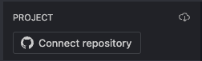

This page outlines commonly asked questions and answers about StackBlitz.

# General FAQs

### Why do I have to Re-Authorize to access GitHub repositories?
As of September 27th, 2023 we started migrating from GitHub's OAuth app to their GitHub App. We received a lot of feedback from users saying that they didn't like the "*all* or nothing" approach that GitHub's OAuth app takes so we've started switching over to the GitHub app itself which allows granularity on a per-repository basis.

To ensure a smooth migration, we converted our "Codeflow bot" app into a "StackBlitz" app. Additionally, we made necessary adjustments to the permissions to enable us to:
- Create repositories and manage
- Import teams to StackBlitz
- Login to StackBlitz

If you have any questions about this process feel free to reach out to [support@stackblitz.com](mailto:support@stackblitz.com)

### Can I make code snippets?

Yes, you can! Here's a [handy video](https://twitter.com/sulco/status/1275039159611203585) featured on Twitter that shows you how to create and use code snippets in StackBlitz.

### Can I use Postman or something similar for testing?

[Postman](https://www.postman.com/automated-testing/) and similar tools will not work since the server is unreachable outside of the browser. As an alternative, you could run a node program that makes requests for testing.

### What are the deploy options available on StackBlitz? 

We support four pathways:

1. If you are in any non-Codeflow StackBlitz project, you can download the project to your local machine by clicking the button right underneath the "Share" dialogue and deploy manually.

2. If you are using an EngineBlock project, you can deploy directly via our [Firebase integration](https://developer.stackblitz.com/guides/user-guide/user-interface#firebase-sidebar).

3. If you are using the Classic Editor, you can click the Connnect Repository button on the top left to easily connect with your desired repository.

4. If you are using Codeflow, you can push code directly into GitHub and then use the [Netlify](https://github.com/apps/netlify) or [Vercel](https://vercel.com/docs/concepts/git/vercel-for-github) GitHub bots to deploy your site.

### Are MongoDB, Mongoose, Postgres or MySQL supported?

Currently, direct TCP database connections are not supported. However,  an API based database provider like [Neon](https://neon.tech/) (a serverless Postgres DB, accessible via API calls) may provide an alternative approach.

### How do I view my invoice?

You can go directly to https://stackblitz.com/settings/membership and click the 'View Invoices' button to view your invoice history.

If you need your invoice for Enterprise Server, please contact your Customer Success Engineer for details.
<!--- Need to figure out what plugin is needed in VitePress to add videos (./assets/view-invoice.mp4). Add this sentence once confirmed:  You can view [this video](./assets/view-invoice.mp4) to see how it's done!
 -->

# Product FAQs

## Editor

### Which runtime does Stackblitz support?

Codeflow runs on top of [WebContainers](/guides/user-guide/available-environments#webcontainers), which currently support **Node.js 16**.

### Does any company use Stackblitz editor for their daily development work?

At StackBlitz, we do! We use the Stackblitz editor for our internal dev work, including PR reviews. In fact, this docs page has been built in the Stackblitz editor.

It's a new product that has **just** been released so check back here in a few months.

### Which repos can/not be opened in Stackblitz editor?

The Stackblitz editor should be able to open any repository. When it comes to *running* it, your toolchain needs to be compatible with WebContainers.

### Does my code persist between sessions?

<!--@include: ./parts/persistance.md-->

## Runtime Environment

### Can I change the Node version?

The Node version is locked so currently, there is no ability to change the Node version.

## Git & GitHub 

### To open a repository in Codeflow IDE, do I need to be signed in both on StackBlitz and GitHub? Or only one of them?

You need to sign in to [StackBlitz](https://stackblitz.com) *using* GitHub.

### Can I run private repositories?

Yes. Private repositories are available for free during beta through 2022. Starting Q1 '23 private repositories will require a subscription. Contact us if you’re interested in learning more about pricing.

### Can I run any Git repository?

At this moment we only support GitHub.com repositories.

## Security

### I would like to use Stackblitz but I'm not sure if it's secure.

Since we’re executing the code entirely in the browser's sandbox, the Stackblitz IDE is actually more secure than running locally. We also use expiring oAuth tokens for interactions with git.

## Package managers

### Which package managers do you support?

<!--@include: ./parts/supported-packages.md-->

## Capabilities & Limitations

### Can I run Vim?

This is perhaps the most frequently-asked question with regards to StackBlitz features - and [one of the oldest issues on our repository](https://github.com/stackblitz/core/issues/3). We have good news: you can run Vim in Codeflow IDE by enabling the extension! 🥳

# Plans
## Personal Plan

### What is the Personal Plan?

The Personal Plan is a free account that allows you to create unlimited public projects in both Classic and Codeflow editors. All you need to do is sign in with your GitHub account!

## Personal+ Plan

### What is the Personal+ Plan?

The Personal+ Plan (formerly known as the Astronaut Plan) allows users to create unlimited private projects in both Classic and Codeflow editors, as well as unlimited file uploads. Personal+ users can also use Codeflow technology for private repositories.

This plan is ideal for individual contributors, students, or developers working on singular projects, or engineering candidates. Users focusing on bug reproductions, fast prototyping, and sharing projects will find this plan sufficient.

## Teams Plan

### What is the Teams plan?

The Teams plan (currently in Beta) is a paid membership offering that allows users to share features amongst members of their GitHub organization. Features and highlights of this plan include:

- Codeflow access for all users in the GitHub organization (in-browser VS Code)
- Instant integration with your GitHub organization’s repos for seamless in-browser editing
    - Utilizing GitHub organization makes it super easy for all users in the organization to use the Codeflow editor and Codeflow bot to create and review pull requests.
- A unified security model for sharing StackBlitz projects and GitHub repos
- User management and billing linked to your GitHub organization
    - Easy to use interface within the StackBlitz dashboard (easy to toggle users for access/no access, all-in-one monthly payment).

If you're interested in Teams Beta, come onboard with us for a private technology preview of this plan! You can sign up [here](https://stackblitz.com/beta-teams-signup).

## Enterprise Server

### What is the Enterprise Server offering?

Enterprise Server is a membership offering that's best fit for organizations who want to use StackBlitz behind their firewall. Benefits include:

- Private NPM registry integration
- Custom SSO integration
- On-prem installation support
- Dedicated Customer Success Engineer

Check out the [Enterprise page](https://stackblitz.com/enterprise) for details and set up a call with our Enterprise team!

### I want to purchase the enterprise edition for WebContainers. Where can I do that?

Bringing WebContainers to Enterprise Server is in the works, but not currently available. You can reach out to enterprise@stackblitz.com for details.

We do offer [WebContainer API](https://webcontainers.io) licenses for organizations wanting to use WebContainer technology for production usage in a for-profit setting. Check out [webcontainers.io](https://webcontainers.io/enterprise) for more information!

# Technology FAQs

## Classic Editor (EngineBlock projects)

### What is the Classic Editor for EngineBlock projects?

Different projects that use the Classic Editor utilize EngineBlock technology to run. As the original StackBlitz interface, the Classic Editor has a file tree, an npm package manager, and a light dev server and preview pane that allows you to see your app as you code.

EngineBlock projects are distinguishable from WebContainer-based projects as they do not have a terminal.

### How do I create code snippets?

Code snippets are available in our Classic Editor for both EngineBlock and WebContainer projects. Click on the Settings icon in the activity bar to the left of your screen. The Settings sidebar will pop open and you will see User snippets and Workspace snippets. User snippets are available for any of your projects. Workspace snippets are only available in the current project you create them in.

### Can I change the TypeScript version in my project?

The current TypeScript starter uses EngineBlock technology, which has a fixed TypeScript version. EngineBlock is great for lightweight frontends, but does not run Node.js itself and will be limited to things like TypeScript versioning.

WebContainers, however, do run Node.js itself in the browser and do not have this limitation. You can simply `npm install` any TypeScript version as you would locally.

## Classic Editor (WebContainers projects)

### What is the Classic Editor for WebContainers projects?

Different projects that use the Classic Editor utilize WebContainers technology to run. As the original StackBlitz UI, the Classic Editor has a file tree, an npm package manager, and a light dev server and preview pane that allows you to see your app as you code.

Since WebContainers technology allows Node.js to run inside the browser, WebContainers projects will always have a terminal available. To learn about WebContainers, visit our docs [here](https://developer.stackblitz.com/platform/webcontainers/browser-support).

### How do I know if my project is WebContainers-based?

All WebContainers projects will have a terminal in the project. You can find what environments are available for EngineBlock and WebContainers projects in our [docs](https://developer.stackblitz.com/guides/user-guide/available-environments).

Any projects in `https://stackblitz.com/?starters=fullstack`, `..?starters=backend`, `..?starters=vite` will be WebContainer/Node projects with a terminal.

### Can I change the Node version in my project?

The current state of Codeflow does not support users being able to set their own Node version.

### Why can't I see my terminal?

Please note that the terminal is only available for WebContainer-based projects. You can use the keyboard binding `^` `` ` `` (the caret and the back quote keys) to toggle the terminal.

### Can I run unit tests in StackBlitz?

You can use [Jasmine](https://jasmine.github.io/), a unit testing tool for JavaScript.

It is also possible to run Angular unit tests inside WebContainer-based projects, but not EngineBlock-based projects. The easiest way to start is by navigating to node.new, which creates a WebContainer-based project automatically!

### Can I develop ElectronJS apps on StackBlitz?

Since Electron is a native app, this cannot be supported since StackBlitz runs entirely within the browser.

## Codeflow Editor

### What is the Codeflow Editor?

The Codeflow Editor brings VSC code into the browser. This editor is capable of running full development workflows, including pushing commits and creating pull requests to GitHub. Other features of the Codeflow editor include a terminal, npm package manager, and the ability to add extensions. This bypasses the need to clone a repository or install dependencies on your local machine. If you haven't already, you can check out Codeflow [here](https://stackblitz.com/codeflow)!

### Can I use Vim bindings?

Our Codeflow editor is built on top of VS Code so you can enable the VIM extension:

1. Open a GitHub repository in Codeflow (like this: pr.new/vitejs/vite)
2. Navigate to the "Extensions" pane
3. Search for "Vim"
4. Click on the VIM extension and then click the "enable" button.

## Web Publisher

### What is Web Publisher?

Web Publisher is a single file editor and publishing tool that can be used for smaller or text-based changes such as editing documentation or blogs. Web Publisher uses Codeflow technology that allows users to create, push, and publish changes all in their browser. The GitHub integration creates a seamless workflow that's fit for developers and non-coding folks alike!

This environment is ideal for:
- No-tech or low-tech users
- Text or formatting changes in documentation or blogs
- Quick fixes that don't require dependency or compilation changes

You can learn more about Web Publisher [here](https://developer.stackblitz.com/guides/user-guide/content-updates-with-web-publisher).

## Classic Editor SDK

### What is the Classic Editor SDK?

Our JavaScript SDK (software development kit) allows users to create Classic Editor projects to be opened in a new window or embedded in your docs, example pages, or blog posts. The SDK can be used to control the UI of an embedded StackBlitz project, change the currently open file(s), and read and write files from the project's virtual filesystem.

Details on embed options can be found [here](https://developer.stackblitz.com/platform/api/javascript-sdk).

## WebContainer API

### What is the WebContainer API?

The WebContainer API allows developers to create fullstack Node.js environments in the browser with WebContainer technology. WebContainer technology powers StackBlitz products like Codeflow and [Web Publisher](https://developer.stackblitz.com/codeflow/guides/user-guide/content-updates-with-web-publisher).

Organizations wanting to use the API for production usage in a for-profit setting are required to purchase a WebContainer API License. With this license, organizations have access to:

- Higher API rate limits
- Direct access to the StackBlitz dev team to optimize performance, prioritize bug fixes, and influence the API roadmap.

This product is ideal for organizations wanting to build completely custom user interfaces powered by Node.js without needing to use virtual machines, servers, or docker containers.

WebContainer API docs can be found [here](https://webcontainers.io/).

### I see that WebContainer API is free to use, but a license is required. Can I use the WebContainer API for commercial purposes?

We are thrilled to offer free access for most users! For those with high levels of commercial usage, we do apply a nominal charge for API requests beyond 10,000 per month. If interested, [please reach out to sales](https://docs.google.com/forms/d/e/1FAIpQLSertiZLl-za0ZHxsWbd2IrISVft2OpPglykEHpEllPSfnZIUg/viewform) for more information!

## Web Publisher

### Which files can be opened in Web Publisher?

Any file type can be opened in Web Publisher.

