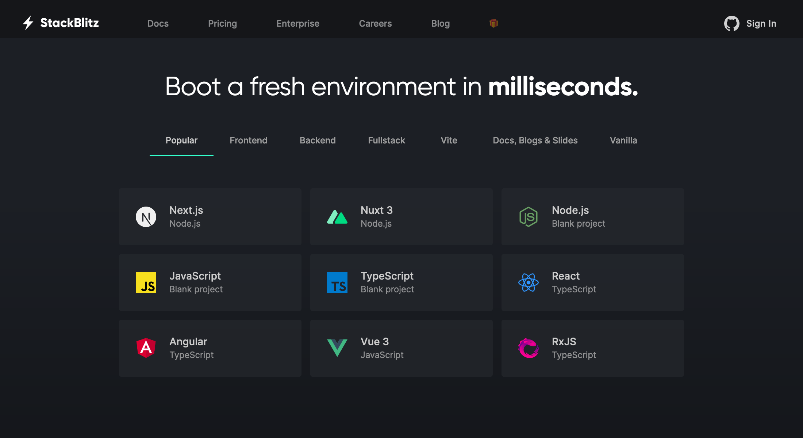
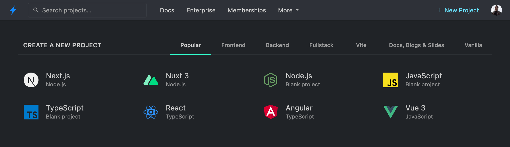
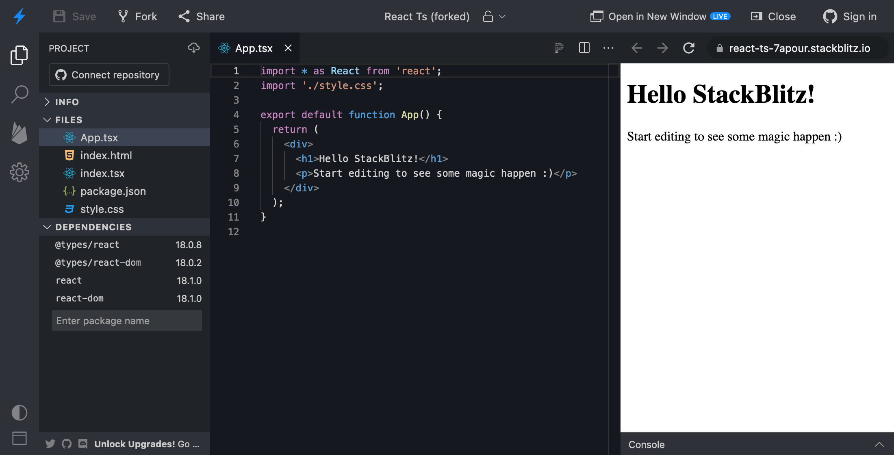

# {{ $frontmatter.title }}

This page outlines how you can start using our StackBlitz editor.

If you wish to immediately embed your project on your page check a page on manual [embeds](/guides/integration/embedding) and [SDK embeds](/platform/api/javascript-sdk). If you wish to learn how to import your project from GitHub, check the the page on [importing projects](/guides/user-guide/importing-projects).

## Picking a starter project

To start coding, navigate to the [StackBlitz homepage](https://stackblitz.com/). If you are not logged in, scroll down a bit to find a list of starter projects to choose from:

If you _are_ logged in, you should see your personal dashboard with a very similar list of starter projects:

You can explore the different categories (for instance, “Popular”, “Frontend”, “Fullstack”) to find a technology stack that you’d like to try out.

Some frameworks also provide short URLs that you can use to create new StackBlitz projects. Check out [the list of “.new domains” here](/guides/user-guide/starter-projects#new-domains).

## Importing code

No starter project for your favorite framework? Or maybe you'd like to import your own code?

Worry not! With StackBlitz, you can [import projects](/guides/user-guide/importing-projects) from your own files or from GitHub repositories.

## Using the StackBlitz editor

Once you’ve chosen or uploaded a project, you should see a StackBlitz editor, which automatically compiles the project’s code to show a result on in the Preview panel on the right. Now, make some changes to the code and see live updates in the Preview!

Intrigued by all the things you see on your screen? Take a tour of [the different parts of the editor](/guides/user-guide/ide-whats-on-your-screen).

:::tip Tip: sign in to save your work
If you’re not signed in yet, we recommend signing in with a GitHub account to make sure that you can save your changes and continue your work later.
:::

## Using StackBlitz on your site

If you’re writing a blog, maintaining a documentation site or an open source project, you can use StackBlitz to:

1. [Embed examples and demos](/guides/integration/embedding) on your page or in your blog posts.
2. [Add “Open in StackBlitz” buttons](/guides/integration/open-from-github) to your READMEs and docs.
3. [Generate custom projects on the fly](/guides/integration/create-with-sdk) with our JavaScript SDK.
4. [Use StackBlitz reproductions in GitHub](/guides/integration/bug-reproductions) bug issue templates!

Happy coding!
