# {{ $frontmatter.title }}

<!-- @include: ./parts/environments.md -->

StackBlitz can be used:
- as an easy way to write and share code without a development environment
- to create or review bug reproductions
- to review pull requests without installing the repository locally
- to create interactive code examples that can be embedded in blogs and documentation
- to build *for* the web *using* the web!

This guide outlines how to get started with StackBlitz. We'll walk you through creating your first project, navigating the editor, and connecting a GitHub repository.

If you already have a project elsewhere you'd like to open in StackBlitz, review the page on [importing projects](importing-projects).

## Create your first project

We recommend starting with one of our pre-built starters.

Navigate to the [StackBlitz homepage](https://stackblitz.com/). If you are not logged in, scroll down a bit to find a list of starter projects to choose from:

If you _are_ logged in, you should see your dashboard:

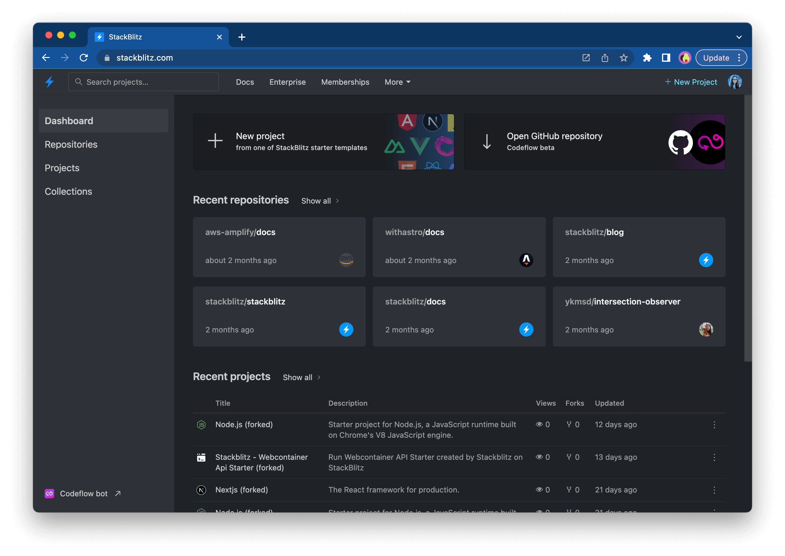

To see a list of available project starters, click on the "New Project" button:

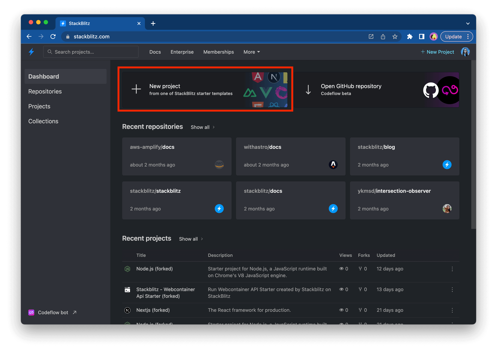

Next, you will see a modal with the available project starters:

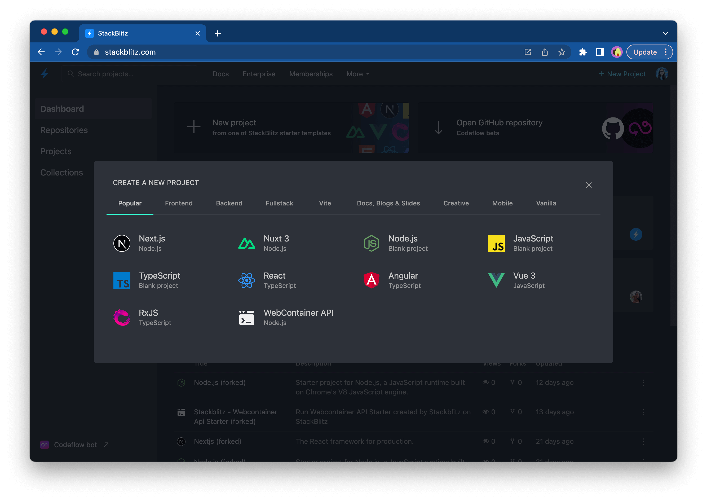

You can explore the different categories (for instance, “Popular”, “Frontend”, “Fullstack”) to find a technology stack that you’d like to try out.

Alternatively, you can open an existing project (created by you or shared with you) in the "Projects" sidebar item:

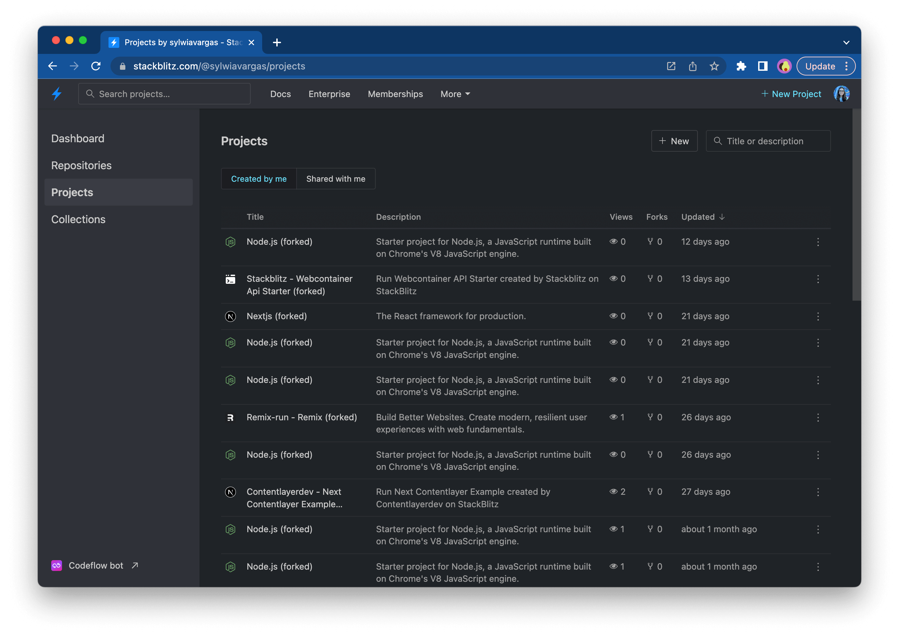

By selecting a starter or existing project, you will be taken to StackBlitz where you can start coding!

:::tip Create a project with a simple URL
Some frameworks also provide short URLs that you can use to create new StackBlitz projects. Check out [the list of “.new domains” here](/guides/user-guide/starter-projects#new-domains).
:::

## Customizing StackBlitz

StackBlitz's next-generation editor is based on VS Code and is compatible with VS Code extensions, themes, and other customizations. 

### Import settings from VS Code

To migrate the settings from your local VSCode to Codeflow IDE, follow these steps:

1. In VSCode open the Settings tab (`cmd` + `,` on MacOS or `alt` + `,` on Windows and Linux).
2. Click on the "Open Settings (JSON)" button, located on the top right side of the view:

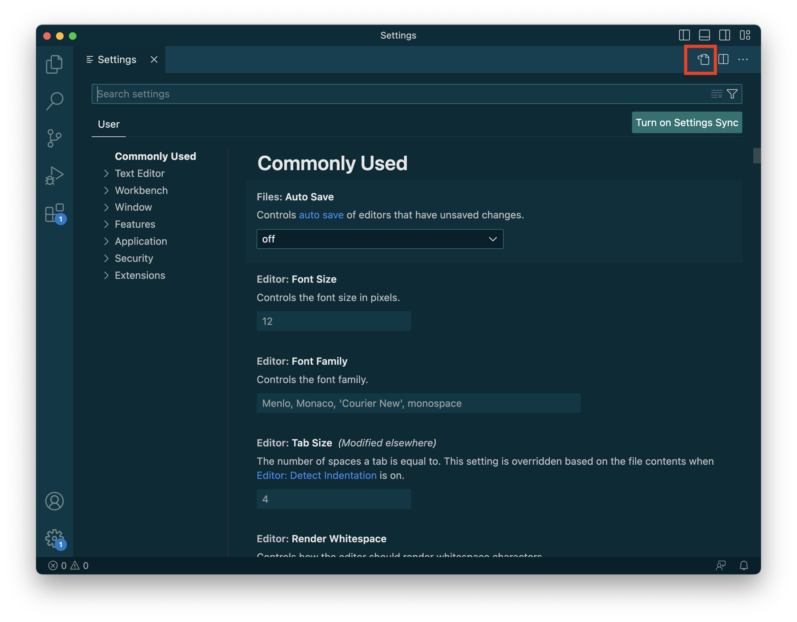

3. This tab contains your VSCode settings. Copy its contents:

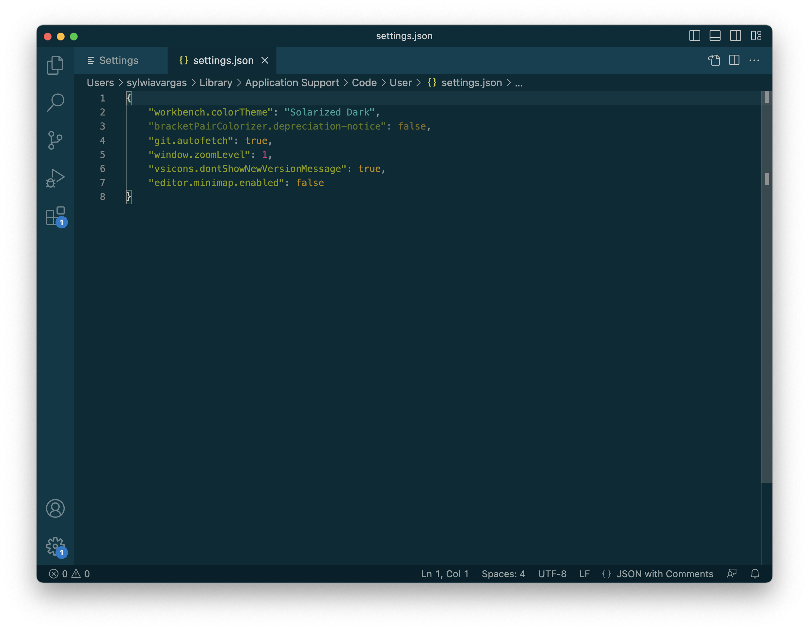

4. Repeat these actions in StackBlitz:
    1. Open the settings tab (you can use `cmd` + `,` key binding on MacOS or `alt` + `,` on Windows or Linux)
    2. Open the JSON view
    3. Paste the copied settings. 
    4. [Optional] Replace the default settings with the ones you copied from your local environment.

The gif below demonstrates these steps:

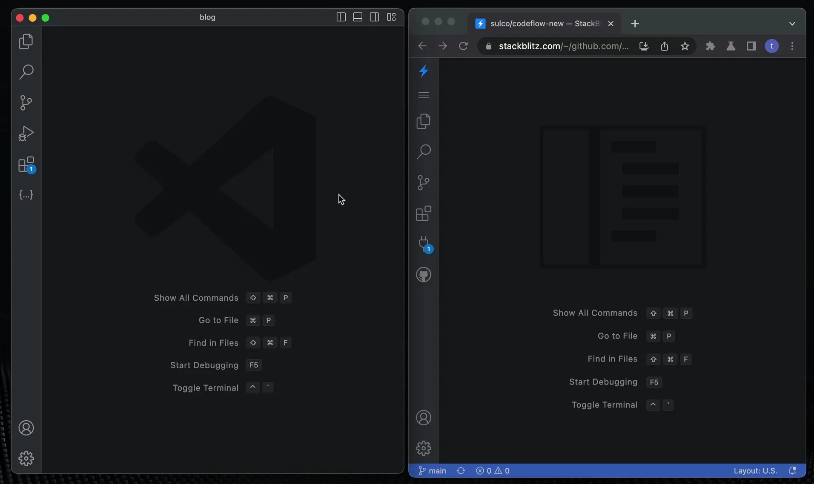

### Environment variables

One way to handle reusable configuration data, such as sensitive data, is to use environment variables. These are encrypted values that can be set for each project and each user. This way, you can customize your configuration data without exposing it to others.

:link: [How to add evironment variables to StackBlitz.](environment-variables)

## Saving changes

Whenever a file is changed, you will see a white dot next to its tab in the editor. 

You will also see that dot on the tab in your browser to remind you that you have unsaved changes.

## Grouping your projects into Collections

[Collections](/guides/user-guide/collections) allow you to group projects together in one place. Use a private Collection to keep personal projects organized or create a public Collection to get a link you can share with others.

[Learn how to create and manage Collections here.](collections)

## Managing projects on your Dashboard

Selecting multiple projects allows you to add them all to an existing [Collection](/guides/user-guide/collections) or delete them. To do so, select a few projects by clicking on the project logo, which will trigger a pop-up menu:

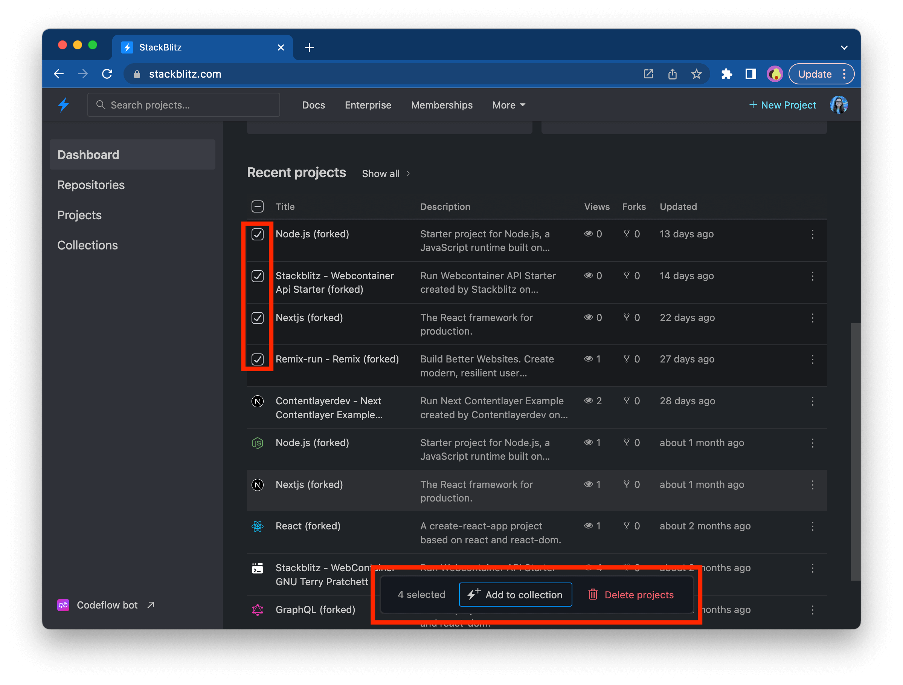

## Opening a GitHub repository in StackBlitz

To work with an existing GitHub repository in StackBlitz, click "Open GitHub repository" on your dashboard.

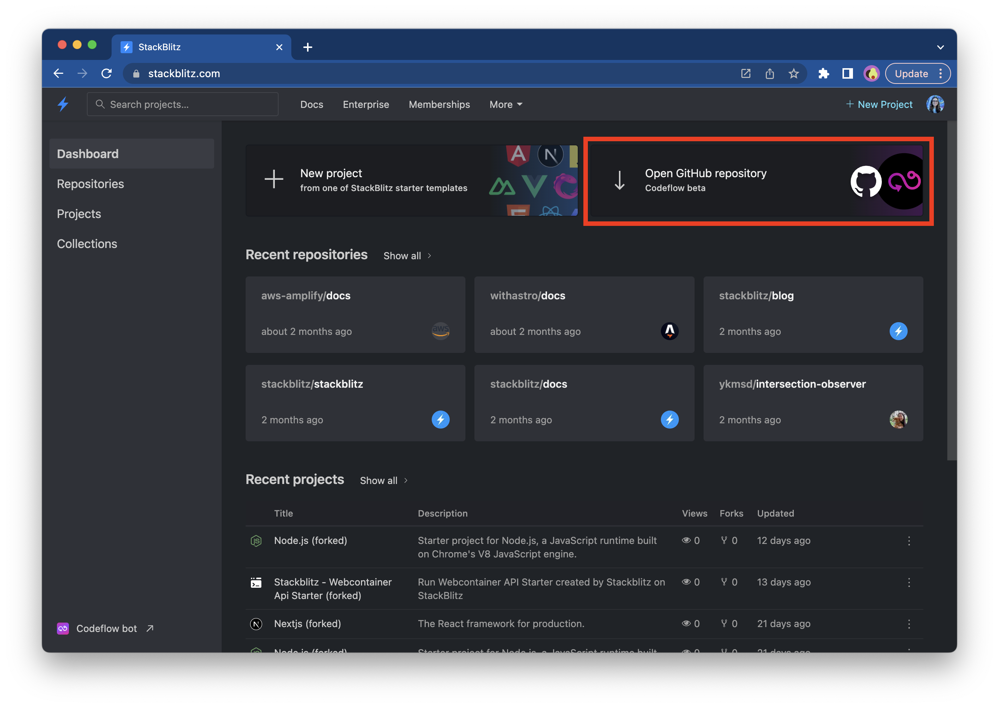

Next, you will see a modal prompting you to provide a GitHub repository URL:

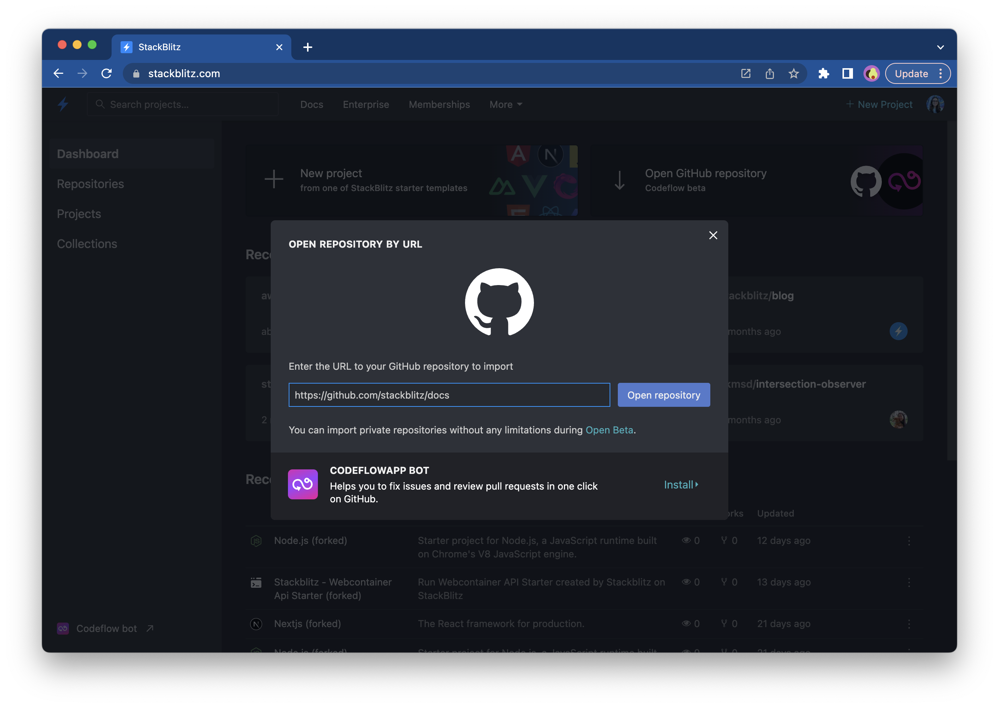

After you provide the URL, click on the "Open repository" button, which will redirect you to StackBlitz.

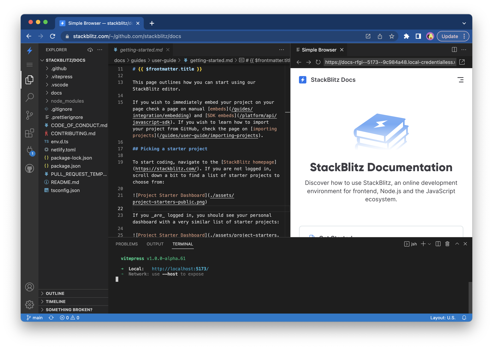

Alternatively, you can view a list of repositories by navigating to the "Repositories" sidebar item:

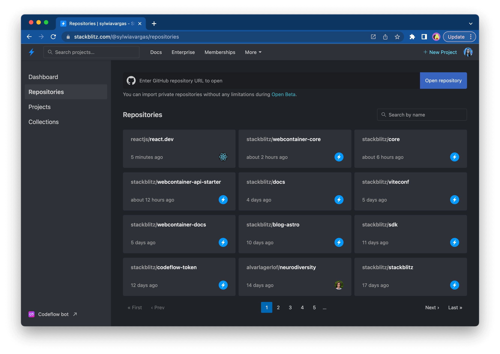

## Using StackBlitz on your site

If you’re writing a blog, maintaining a documentation site or an open source project, you can use StackBlitz to:

1. [Embed examples and demos](/guides/integration/embedding) on your page or in your blog posts.
2. [Add “Open in StackBlitz” buttons](/guides/integration/open-from-github) to your READMEs and docs.
3. [Generate custom projects on the fly](/guides/integration/create-with-sdk) with our JavaScript SDK.
4. [Use StackBlitz reproductions in GitHub](/guides/integration/bug-reproductions) bug issue templates!
5. [Make PR reviews safer and faster](https://developer.stackblitz.com/guides/integration/integrating-codeflowapp-bot) with the StackBlitz app for GitHub.
6. [Provide a one-click environment](https://developer.stackblitz.com/guides/integration/using-pr-new) so other developers can submit bug fixes without setting up the local environment.

## Troubleshooting

### Out of memory error

Keeping several StackBlitz projects open at the same time may cause your browser to run out of memory. In this case, you will see the following popup:

### Preview doesn't work

If the Preview doesn't work, oftentimes browser configuration or browser incompatibility is the culprit. Please see [this page for troubleshooting](/platform/webcontainers/browser-support). 

### Preview stopped working / is not responding

Please note that, depending on the framework, **some changes may cause the dev server to stop running**, which in turn causes the Preview to either not respond to new updates or show an error screen ("Unable to connect to `local.webcontainer.io`"). 

Check in the terminal if the dev server is still running. If you want to restart it, click in the terminal window and:
1. press `ctrl`+`c` to "kill" the server,
2. press the "up arrow" button to bring up the start command,
3. press enter to run that command,
4. in the popup notification in the bottom right corner, choose to open the Preview.

### Reopening the Preview panel 

If you close the Preview by accident, you can reopen it by selecting the icon of a plug entitled "Ports in use" from the left-side navigation bar. Note that you can open the Preview in a separate tab or as a split screen.

Happy coding!
