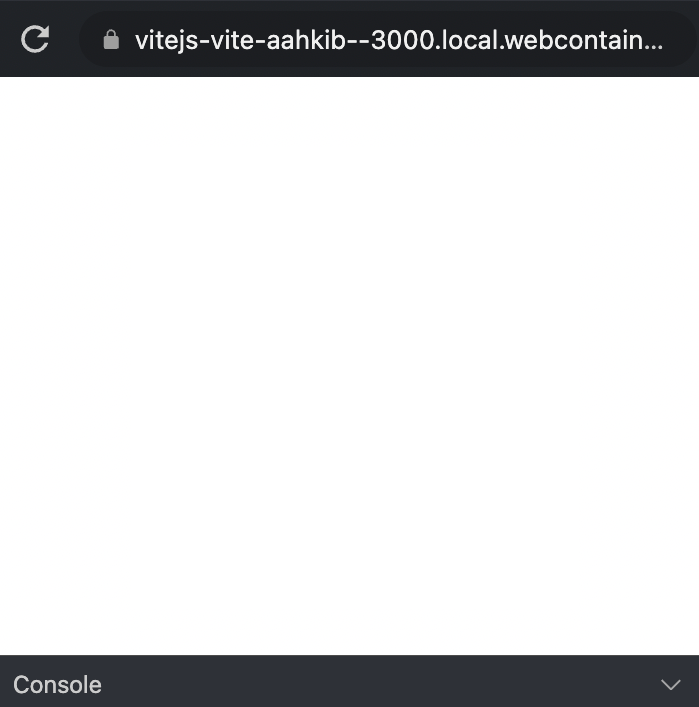

# {{ $frontmatter.title }}

This page provides an overview of the terms we use to describe each of the pieces of the user interface (UI) available to you in StackBlitz projects.

<figure>
    
    <figcaption>Overview of the StackBlitz IDE user interface elements</figcaption>
</figure>

## Menu Bar

<figure>
  
  <figcaption>Screenshot: Menu Bar</figcaption>
</figure>

The Menu Bar is where you perform general operations on your StackBlitz project. It includes, from left to right:

- The StackBlitz logo. If you are logged in, it links to your dashboard. Otherwise, it links to the StackBlitz home page.
- The buttons to save, fork (create a copy of the project), and share the project. If the project is connected to a GitHub repository, you will also find the commit button here.
- The project owner's avatar which is also a link to their StackBlitz profile page.
- The project title. If you are the project's owner, you can click on it to change it.
- The project visibility icon. If you are the project's owner, you can click it to edit project information such as title, description, URL, or whether the project is public, private or secret.
- The buttons to open the app preview in a new window and to close the integrated [preview](#preview).

## Activity Bar

The Activity Bar allows you to select a view to display in the [sidebar](#side-bar) from the available:

- [Project](#project-sidebar) - opens the Project sidebar
- [Search](#search-sidebar) - opens the Search sidebar
- [Firebase](#firebase-sidebar)  - opens the Firebase sidebar ([EngineBlock][] projects only)
- [Ports in use](#ports-in-use-sidebar)  - opens the Ports in Use sidebar ([WebContainers][] projects only)
- [Settings](#settings-sidebar)  - opens the Settings sidebar

## Sidebar

When you open a StackBlitz project, the Sidebar defaults to the _Project_ icon's expanded view. You can open a different view by clicking on the icons in the [Activity Bar](#activity-bar).

### Project Sidebar

<figure class="float-left" style="width: 200px">
  
  <figcaption>Screenshot: Project sidebar</figcaption>
</figure>

The _Project_ sidebar view includes the project description (if its author provided one), allows you to browse the project files and, if you are the project owner, to connect the project to a GitHub repository.

In the [EngineBlock][] environment, the _Project_ sidebar also displays the project's npm dependencies list.

### Search sidebar

The _Search_ sidebar allows you to find all the given string occurrences in your project. The search can be case-sensitive or use regular expression (regex).

### Ports in use sidebar

The _Ports_ sidebar lists all the ports opened by your app. Clicking on the port opens it in a new window. This sidebar is displayed in the [EngineBlock][] environment only.

### Firebase sidebar

The _Firebase_ sidebar allows you to deploy a production version of your project using Firebase Hosting. This sidebar is displayed in the [EngineBlock][] environment only.

### Settings Sidebar

The _Settings_ sidebar includes some project-level and user-level customization options. You can use it to configure your editor, set up snippets and freeze or delete the project.

In the [EngineBlock][] environment the _Settings_ sidebar allows you to also customize the development server running your app:

- **Reload mechanism** – when the code updates, it specifies if the changes be applied without reloading the preview window ("Hot reload"), using the [HMR mechanism](https://webpack.js.org/concepts/hot-module-replacement/) or should the preview window be reloaded ("Page reload"). "Hot reload" usually offers a better development experience but keep in mind that if your app relies on the global event handlers (like `setInterval`), they may persist between the updates.
- **Reload trigger**, which specifies what triggers the app to update in the [Preview](#preview). The "Edit (auto)" option picks up updates automatically whenever you stop typing in the editor for about one second, the "Save" option only updates when you save the file, and the "Keystroke" option updates whenever you press a key in the editor.
- **Clear console on reload** – when the "Reload mechanism" is set to "Hot Reload", this option allows you to keep the [Console](#console) messages between updates ("Disabled") or to automatically clear them ("Enabled") as if you have manually run `console.clear()` in your code.

## Editor

<figure style="width: 400px">
  
  <figcaption>Screenshot: Editor</figcaption>
</figure>

The Editor section of the IDE displays the content of the currently selected file. You can perform several actions in the Editor's top-right side such as format code with [Prettier](https://prettier.io) or manage the file tabs if you have several open.

## Terminal

<figure style="width: 400px">
  
  <figcaption>Screenshot: Terminal</figcaption>
</figure>

**NOTE:** the terminal is only available in the [WebContainers][] projects.

The Terminal allows you to run commands, such as `ls`, `mkdir`, `npm start`, `node index.js`, and others – the same way you would on your local machine.

## Preview

<figure class="float-right" style="width: 300px">
  
  <figcaption>Screenshot: Preview</figcaption>
</figure>

The Preview displays the application or webside that you are building in the [Editor](#editor). It is like a mini browser inside your browser: it includes an address bar which displays the URL of your app, the actual app (rendered inside an iframe) and, in the [EngineBlock][] projects, a JavaScript [Console](#console).

If you prefer to view your app in a separate window, you can use the "Open in New Window" button located above the Preview. It will close the Preview and open your app in a separate browser tab instead.

## Console

<figure class="float-right" style="width: 300px">
  
  <figcaption>Screenshot: Console</figcaption>
</figure>

In the [EngineBlock][] projects the [Preview](#preview) includes a Console. The Console outputs JavaScript errors and messages from `console.log` methods in your app. It is meant as a lightweight replacement of browser's [DevTools](https://developer.chrome.com/docs/devtools/overview/#console). It is also useful if you are sharing a project and you want to make sure that people see these JavaScript output messages without having to tell them to open the actual DevTools.

As an example, see how the RxJS starter project [uses the Console to display a "Hello, World!" message](https://stackblitz.com/edit/rxjs?devtoolsheight=60).

[EngineBlock]: /guides/user-guide/available-environments
[WebContainers]: /guides/user-guide/available-environments
