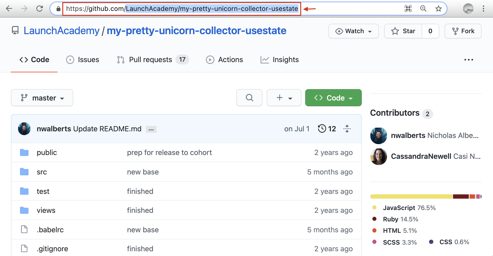
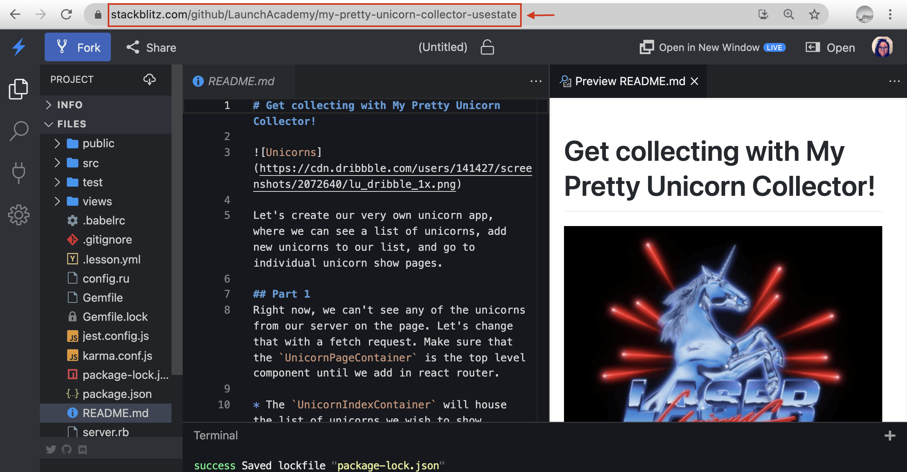
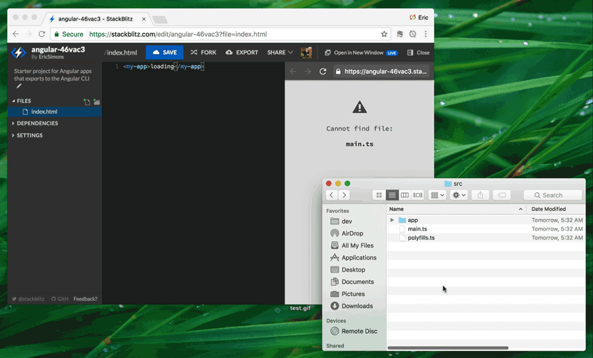

# {{ $frontmatter.title }}

## Import from GitHub

You can run any public GitHub repository on StackBlitz by adding the username and repository name to the URL like so:

`stackblitz.com/github/{GH_USERNAME}/{REPOSITORY_NAME}`

If you want, you can also specify a branch, tag, or commit:

`.../github/{GH_USERNAME}/{REPOSITORY_NAME}/tree/{TAG|BRANCH|COMMIT}`

Whenever you push commits to GitHub, the corresponding StackBlitz project automatically updates with the latest changes ensuring that the code in your GitHub repository remains the source of truth.

:::info Note
While you can import from GitHub any projects with a `package.json`, the unsupported technologies will not run. This includes backend languages not supported by Node.js (like PHP, Python, or Java), databases like MySQL and PostgreSQL that require a binary server process, and some specific npm packages which are not fully compatible with WebContainers yet.
:::

### Defining a launch command

Oftentimes, the first thing you do when opening a project is to launch a command, for instance, to run a development server.

Usually, these kinds of commands exist in the `scripts` section of your project's `package.json` file and you would manually type `npm run dev` to execute them.

Using StackBlitz, you can provide an [npm script](https://docs.npmjs.com/cli/v8/using-npm/scripts) to run automatically when the editor opens with the `startScript` query parameter:

`stackblitz.com/fork/github/{gh_username}/{repository_name}?startScript={npm_script_name}`

:::tip Example
The following URL will open the `vitesse` repository of the `antfu` user, install the npm dependencies, and run `npm run dev` command in the terminal:

[stackblitz.com/github/antfu/vitesse?startScript=dev](https://stackblitz.com/github/antfu/vitesse?startScript=dev)

Click on it and see the effect yourself!
:::

### Changing the title of the imported project

When importing a project from GitHub, the project title will default to the GitHub project owner's name and repository name.

You can customize the title of the imported project by adding the `title` query parameter to the URL like so:

`stackblitz.com/fork/github/{gh_username}/{repository_name}?title={custom title}`

For instance, the URL from the previous section would now become:

[stackblitz.com/github/antfu/vitesse?title=Hello](https://stackblitz.com/github/antfu/vitesse?title=Hello)

:::tip
You can chain the URL query parameters by adding the `&` sign between them, for example:

[stackblitz.com/github/antfu/vitesse?title=Hello](https://stackblitz.com/github/antfu/vitesse?title=Hello&startScript=dev)
:::

## Upload from your computer

With your desired StackBlitz project open, drag and drop any files or a folder you want to import:

## Importing or creating projects with StackBlitz API

You can create new StackBlitz projects programmatically from any data source using our [POST API](/platform/api/post-api) or the [openProject](/platform/api/javascript-sdk#openproject) and [embedProject](/platform/api/javascript-sdk#embedproject) methods in our [JavaScript SDK](/platform/api/javascript-sdk).
