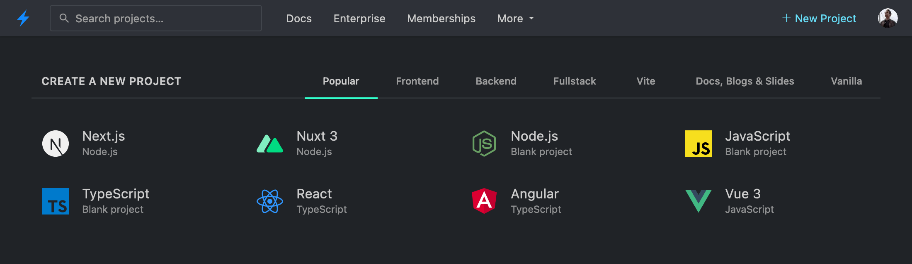

# {{ $frontmatter.title }}

This page covers what starter projects are, where to find them, and how to create a new one.

## What are starter projects?

Starter projects are online playgrounds, typically built by the core team of a given project and run on StackBlitz. They are used in project documentation or found under [a custom link](#new-domains). You can find some of them on our dashboard.

## .new domains

Open Source projects can provide a custom URL as a convenient starting point for their online playground. Here is a list of some of these links:

<StarterGrid :links="dotNewLinks" />

## Adding a new starter project

If you'd like to see a new starter, please follow the directions on [this page in the integration guide](/guides/integration/open-from-github#set-up-the-main-starter-url).
