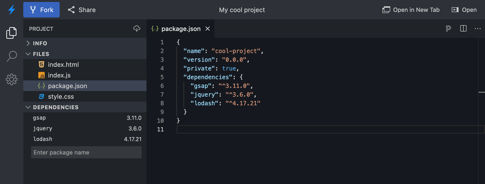

# {{ $frontmatter.title }}

When creating new projects with the [`sdk.openProject`](/platform/api/javascript-sdk#openproject) and [`sdk.embedProject`](/platform/api/javascript-sdk#embedproject) methods, you can specify which npm dependencies should be installed on startup.

The expected way to specify dependencies depends on the [runtime environment](/guides/user-guide/available-environments).

:::info Reminder
Projects created with the `template: 'node'` option will use the WebContainers environment (currently on stackblitz.com only). Projects created with a different `template` value will use the EngineBlock environment (available on stackblitz.com and StackBlitz Enterprise Edition).
:::

## With WebContainers

For WebContainers project, our [Turbo package manager](/platform/webcontainers/turbo-package-manager) will install `dependencies` and `devDependencies` from the project’s `package.json` file, much like `npm`, `pnpm` or `yarn` would.

For those projects, you can provide your dependencies directly in the `package.json` file, and ignore the `project.dependencies` option. Here’s an example:

```js
import sdk from '@stackblitz/sdk';

const packageJson = `{
  "name": "node-starter",
  "version": "0.0.0",
  "scripts": {
    "start": "serve public"
  },
  "dependencies": {
    "serve": "^14.0.0"
  }
}`;

const project = {
  title: 'Node serve demo',
  description: 'Node.js server demo using the "serve" package',
  template: 'node',
  files: {
    'package.json': packageJson,
    'public/index.html': '<h1>Hello world!</h1>',
  },
};

sdk.openProject(project);
```

:::tip DEMO
Check this complete Angular project:

- [TypeScript demo](https://stackblitz.com/edit/sdk-webcontainers-dependencies-ts)
- [JavaScript demo](https://stackblitz.com/edit/sdk-webcontainers-dependencies-js)
:::

## With EngineBlock

For EngineBlock projects, provide dependencies using the `project.dependencies` option. The `package.json` file will not be used to resolve dependencies, but it is still highly recommended to provide one so that your project can continue to work as expected when downloaded with the right `devDependencies` and `scripts`. You can customize `devDependencies` and other properties of `package.json`, but dependencies for EngineBlock are always resolved using `project.dependencies` instead of `package.json`.

### Dependencies plus package.json

In the next example, we will show how to generate this project:



Since we don’t want to risk having mismatched dependencies, we’ll define the `package.json` data first, and use that to set the `project.dependencies` as well.

```js
import sdk from '@stackblitz/sdk';

const PACKAGE_JSON = {
  name: 'cool-project',
  version: '0.0.0',
  private: true,
  dependencies: {
    gsap: '^3.11.0',
    jquery: '^3.6.0',
    lodash: '^4.17.21',
  },
};

const project = {
  title: 'My cool project',
  description: 'Example animation project',
  template: 'javascript',
  // REQUIRED: specify dependencies
  dependencies: PACKAGE_JSON.dependencies,
  files: {
    // Recommended: provide a package.json file with the same dependencies
    'package.json': JSON.stringify(PACKAGE_JSON, null, 2),
    'index.html': '<h1>Hello world!</h1>',
    'index.js': 'import gsap from "gsap";\n// etc.',
  },
};

sdk.openProject(project);
```

:::tip DEMO
Check this complete Angular project:

- [TypeScript demo](https://stackblitz.com/edit/sdk-angular-dependencies?file=project.ts)
- [JavaScript demo](https://stackblitz.com/edit/sdk-angular-dependencies-js)
:::

### Inherited dependencies

A useful but sometimes confusing feature of the `project.template` value is that it will retrieve an initial dependency list from a “parent” project. For instance, when using the `template: 'angular-cli'` option to generate an Angular project on stackblitz.com, the dependencies and version numbers from https://stackblitz.com/edit/angular will be used initially.

At this time, there is no way to control which project is selected as the “parent” project for a given `template` value.

In some cases, inherited dependencies can cause your project to show:

- unnecessary dependencies;
- outdated package versions.

To work around this problem, we recommend specifying all the dependencies and the version ranges your project uses with the `project.dependencies` option.
