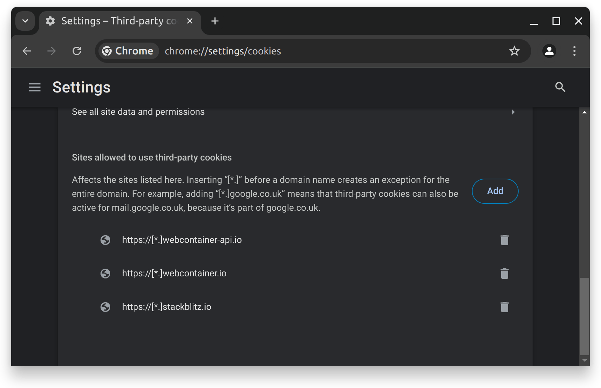

# {{ $frontmatter.title }}

Most of the time, WebContainers run fine [in supported browsers](/platform/webcontainers/browser-support). However, some browsers have default content restrictions, like third-party cookie and Service Worker blocking, that can prevent StackBlitz WebContainers from running properly. Here’s how you can troubleshoot and work around the most common issues.

## Why do I need to add exceptions for StackBlitz?

WebContainers use a combination of different technologies, such as [Service Worker](https://developer.mozilla.org/docs/Web/API/Service_Worker_API) and [WebAssembly](https://developer.mozilla.org/docs/WebAssembly), across several domains. Each running project has its own domain, and needs to install a Service Worker for that domain to work properly.

In some browsers, this feature is blocked by “third-party cookie” or “third-party storage” restrictions. These are legitimate restrictions when the third-party domain is an ad server or a tracking server, but in the case of WebContainers the third-party domain is where your project code runs.

## Allowing cookies for a single project

If you observe any odd behavior when running StackBlitz projects like a command that hangs forever or a web preview that never shows up, check if your browser is indeed blocking cookies.

For instance, in Chrome, click the lock icon in the navigation bar:


If that is the case, choose to “Allow” cookies for those third-party domains. After that, the browser will prompt you to reload the page and you will be able to run the current project.

Note that the list of blocked domains might look different for you. In particular, a `xyz.local.webcontainer.io` domain might not be present. WebContainers-based projects use different domains dynamically, depending on what the runtime is doing (for instance, whether it is serving HTTP content or not), so you might need to check the list of blocked domains later if you see something off again.

Alternatively, follow the procedure below to unblock any StackBlitz project.

## Allowing all StackBlitz projects

To allow all StackBlitz projects to use third-party cookies, go to your browser’s cookie preferences, and add exceptions for the following URL patterns:

```
https://[*.]stackblitz.io
https://[*.]webcontainer.io
```

For instance, in Chrome, go to [chrome://settings/cookies](chrome://settings/cookies) and add those exceptions in the “Sites that can always use cookies” section.




## Enabling WebAssembly

Some browsers might disallow usage of WebAssembly by default. For instance, Microsoft Edge does that when “Enhance your security on the web” is selected. To allow StackBlitz projects to run, add an exception for the following sites:

```
stackblitz.com
[*.]staticblitz.com
```

For instance, in Edge you can do that in [edge://settings/privacy](edge://settings/privacy) → “Enhance your security on the web” → “Exceptions”.


