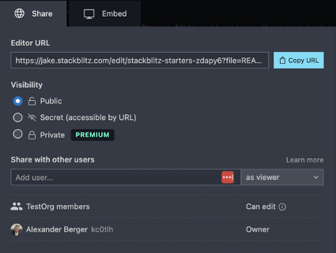
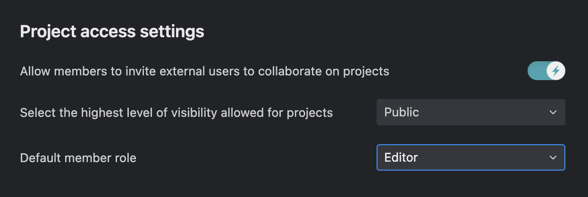

# {{ $frontmatter.title }}

### Github Repositories
StackBlitz Teams seamlessly ingest all repository access controls directly from your Github Organization: if a user has access to a repository in Github, they will have the same access with their paid StackBlitz Teams account. You can read more on controlling access to Github Organization on this [GitHub documentation page](https://docs.github.com/en/organizations/collaborating-with-groups-in-organizations/about-organizations).

### StackBlitz Projects
By default, all StackBlitz projects created within a Team are publicly viewable via their unqiue URL and anyone in the Team can see them in the StackBlitz Dashboard and has edit access to them. Any project owner can change the visibility settings and add additional editors or co-owners by clicking the “Share” button within the project which will bring up the settings pane shown below:

### Team settings
When collaborating inside a StackBlitz Team, you have these additional controls:
- Allow or disallow team members from inviting external users to collaborate on projects created inside the team.
- Select the highest level of external visibility (to those outside the team) allowed for projects created inside the team (private, secret, or public).
- Default member role allows you to set the default level of access that members of the team have to newly created projects (co-owner, editor, or viewer). This can be changed on an individual project-by-project basis as well.

:::tip
Currently it is not possible to hide projects from other members within the StackBlitz Team. Selecting Visibility: Private will only hide the project from users NOT in the Team. [Let us know](mailto:hello@stackblitz.com) if additional configurability here is important to you.
:::