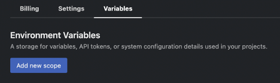
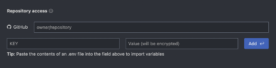
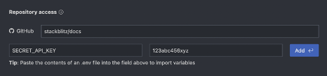
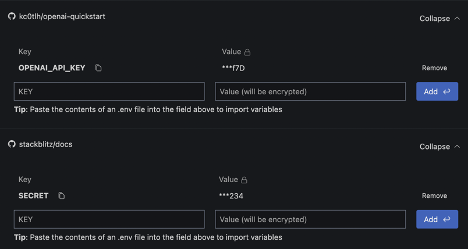

# {{ $frontmatter.title }}

The Environment Variables feature provides secure storage for secrets, variables, API tokens, or system configuration details used in your projects. These secret variables are scoped to specific repositories during the setup process, and are only accessible on an individual user level (for instance, they are not shared with your StackBlitz Team members). 

Follow these steps to store a secret environment variable and scope it to a registry:

1. Navigate to https://stackblitz.com/settings/variables 
2. Click “Add new scope”

3. Enter the Github repository you want to make the variable available for, a name for the variable in the KEY field, and the variable itself in the Value field:

4. Click “Add” to save the variable and it will now be available in designated repository

You can always return to this settings page in the future to add or remove variables from specific registries:

