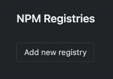
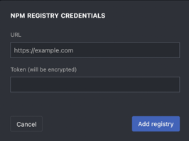

# {{ $frontmatter.title }}

To integrate with your private NPM registry you will first need to ensure that it is accessible from the internet, without needing to log into any proxies or VPNs. 

:::tip
If your registry is behind a corporate firewall, than you will likely need StackBlitz Enterprise installed behind the corporate firewall/on-prem in order to access your private NPM registry. For more information on Enterprise you can [reach out to sales here](https://stackblitz.com/enterprise-contact).
:::

If you can ping/access your registry without a proxy or firewall then you can follow these steps to connect it to your StackBlitz Teams plan, allowing all teammates access:

1. Gather your Registry URL & Access Token 
    These items can be found in your private npm registry server settings. 
    - [Jfrog Artifactory Documentation](https://jfrog.com/help/r/jfrog-artifactory-documentation/jfrog-artifactory)
    - [Sonatype Nexus Documentation](https://help.sonatype.com/repomanager3)
2. Navigate to `https://stackblitz.com/orgs/github/[YOUR_ORG_NAME]/npm_registries` and scroll to the bottom of the page
3. Click “Add new registry”

4. Enter the URL and Access Token, and click “Add registry”

5. All package installations for your team will now run through your private registry
