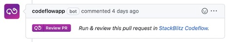

# {{ $frontmatter.title }}

To add one-click pull request reviews to your team, you will need to install the CodeflowApp bot into your Github organization and select which repos you want it to integrate with. Navigate to [the installation page here](https://stackblitz.com/install-github-app) to initiate the installation process. 

Once installed, it will comment on every PR with a link to instantly run and review it:

For more information & troubleshooting you can checkout the [CodeflowApp documentation here](https://developer.stackblitz.com/guides/integration/integrating-codeflowapp-bot).
