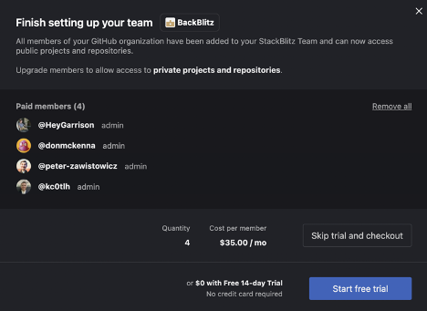
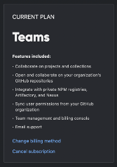
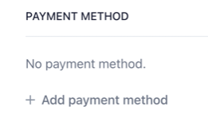

# {{ $frontmatter.title }}

Each StackBlitz Team must be linked in a 1:1 relationship with a corresponding [Github Organization](https://docs.github.com/en/organizations/collaborating-with-groups-in-organizations/about-organizations). 

:::tip
In the future we plan to support additional version control providers & Teams creation pathways. If linking to a Github Org doesn’t work for you, please [reach out](mailto:hello@stackblitz.com) and let us know how we can meet your team’s needs!
:::

To create a StackBlitz Team:
1. Navigate to https://stackblitz.com/pricing 
2. Login with a Github account that has Administrator privileges for the Github Organization you will be using to create your StackBlitz Team
3. Click “Select a Team” and click the Github Organization you want to upgrade to StackBlitz Teams

4. Select which members of your Github Organization you want to have a paid StackBlitz Teams account

5. Either: Start a 14 day free trial OR Skip trial and checkout
6. Notify Invited Team Members

7. Enjoy frictionless collaboration with your team!

:::tip 
If you opt for the free trial, you will need to add a payment method before the trial expires to continue using the paid Teams features. To do so: 

1. Click “Update Billing” on the trial banner

2. Click “Change billing method”

3. Add a payment method

Your StackBlitz Team will now automatically renew as a paid Teams plan at the end of your free trial!
:::
