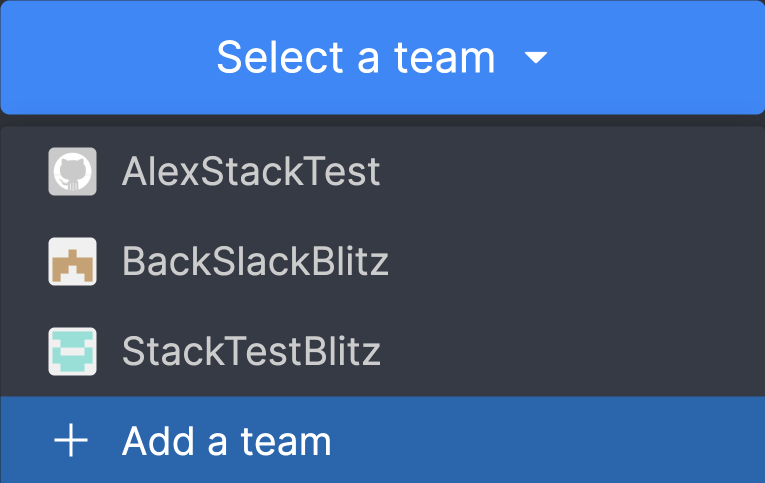
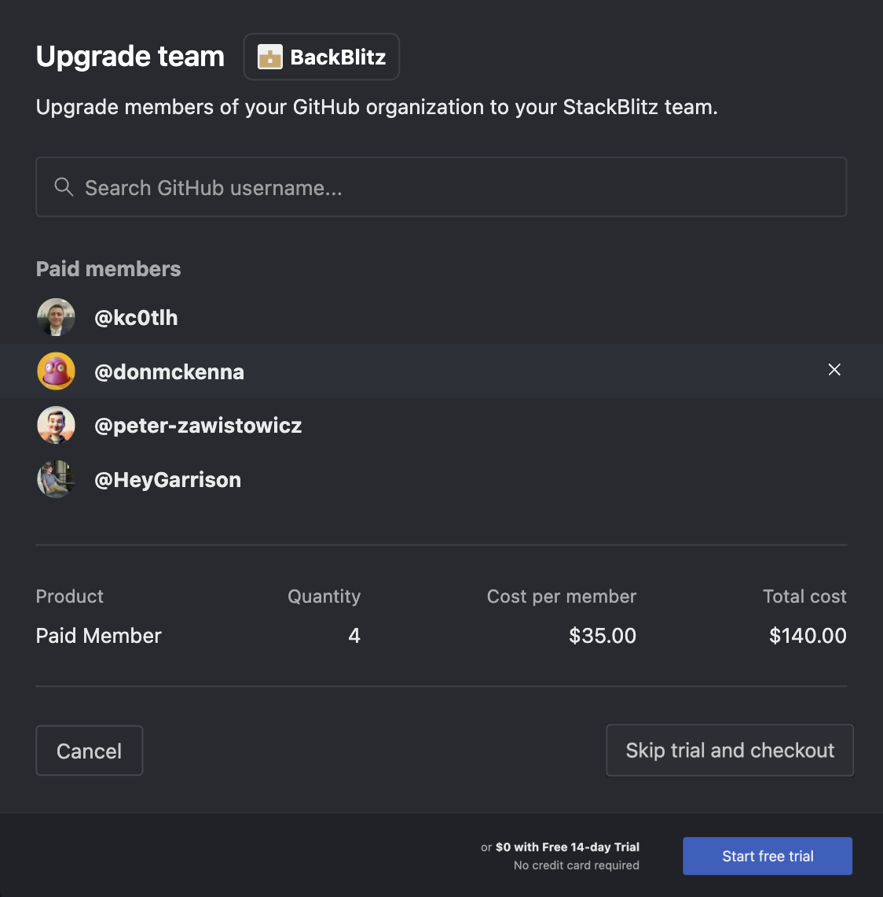

# {{ $frontmatter.title }}

Each StackBlitz Team must be linked in a 1:1 relationship with a corresponding [Github Organization](https://docs.github.com/en/organizations/collaborating-with-groups-in-organizations/about-organizations). If you do not yet have a GithHub Organization, [set one up for free here](https://github.com/account/organizations/new?plan=free) before continuing with the StackBlitz Teams setup process.

:::tip
In the future we plan to support additional version control providers & Teams creation pathways. If linking to a Github Org doesn’t work for you, please [reach out](mailto:hello@stackblitz.com) and let us know how we can meet your team’s needs!
:::

There are three pathways for setting up a StackBlitz Team depedning on your user persona:  

:arrow_right: [Creating New StackBlitz Team From Scratch](#creating-new-stackblitz-team-from-scratch) 
This section is for users who are looking to initiaite the StackBlitz Teams setup process. If you are unsure where to start, you should start here.  

:arrow_right: [Approve an Existing Request to Setup Teams](#approving-a-request-for-stackblitz-teams) 
If you are the GitHub Organization Admonistrator and someone on your team has requested StackBlitz Teams, this is the section for you.  

### Creating New StackBlitz Team From Scratch

To create a StackBlitz Team:
1. Navigate to https://stackblitz.com/pricing 
2. Login with a Github account that is a member of the Github Organization you will be using to create your StackBlitz Team.
3. Click “Select a Team” and click the Github Organization you want to upgrade to StackBlitz Teams or click "Add Team" if your organization is not listed:

4. You will now be prompted to authorize StackBlitz Teams to integrated with your Github Organization:

At this point you will see a different green button depending on whether you have admin rights for the GitHub organization:

:bulb: If you are not an admin, this is as far as you can progress without assistance. Your GitHub organization admin(s) will now recieve an email from GitHub requesting their approval. Please share [these instructions ](#approving-a-request-for-stackblitz-teams) with your admin(s) on how to complete the process!  

If you are an admin, continue setting up your team below:

5. Select which members of your Github Organization you want to have a paid StackBlitz Teams account:

6. You can now either start a 14 day free trial or skip trial and checkout via Stripe.

8. Enjoy frictionless in-browser code collaboration with your team!

:::tip 
If you opt for the free trial, you will need to add a payment method before the trial expires to continue using the paid Teams features. To do so: 

1. Click “Update Billing” on the trial banner

2. Click “Change billing method”

3. Add a payment method

Your StackBlitz Team will now automatically renew as a paid Teams plan at the end of your free trial!
:::

### Approving a Request for StackBlitz Teams 
If someone in your organization has requested StackBlitz Teams, these instructions will enable you, the GitHub Organization admin, to complete their request and initiate a 14 day free trial of Teams.

> For an introduction to StackBlitz Teams and what they can do for your organization, check out the [What is StackBlitz Teams page here](./what-is-stackblitz-teams.md).

1. 